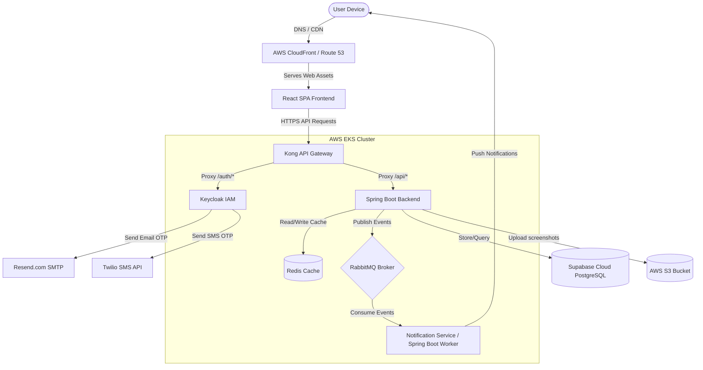
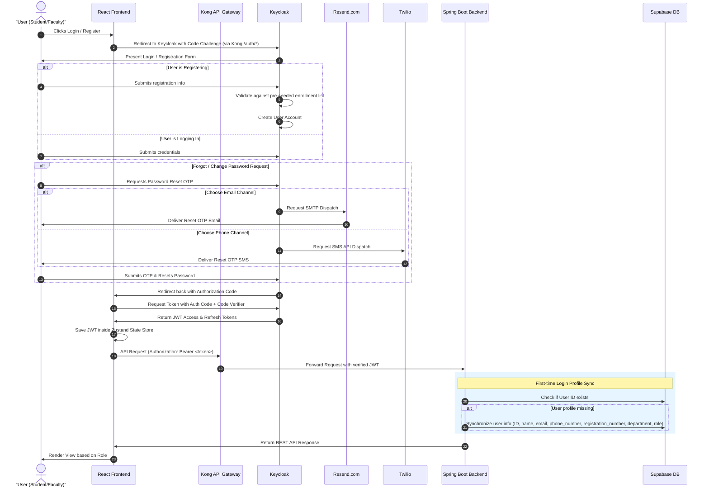

# High-Level Design (HLD)

## 1. Cross-System Architecture & Topology

The application utilizes a decoupled client-server architecture. The frontend is hosted as a static Single Page Application (SPA), while the APIs and Identity Management are managed inside an AWS Elastic Kubernetes Service (EKS) cluster. 

### 1.1 Infrastructure Components
*   **DNS & CDN Hosting:** Frontend assets (compiled React package) are hosted in AWS S3 and served through AWS CloudFront to reduce latency. Route 53 routes domains to the CloudFront distribution and the Kong API Gateway entry point.
*   **Infrastructure as Code (IaC):** Terraform scripts provision the network subnets (VPC), Route 53 DNS records, the S3 bucket for screenshots, and the EKS clusters.
*   **EKS Kubernetes Deployments:** Deployed via Helm charts using isolated deployment configurations (`values-dev.yaml` and `values-prod.yaml`).
*   **Managed Database:** PostgreSQL schemas are provisioned and hosted on managed Supabase Cloud.
*   **Asynchronous Message Broker (RabbitMQ):** Deployed inside the EKS cluster (via Helm/Operator) to handle event-driven decoupling and queuing of notification dispatches.
*   **In-Memory Caching (Redis):** Deployed inside EKS to cache frequent queries (like event listings) and handle temporary rate-limiting.

---

## 2. Authentication Flow (OAuth 2.0 + PKCE)

To secure user access, the application implements the **Authorization Code Flow with Proof Key for Code Exchange (PKCE)**. 

### 2.1 Role Creation & Assignment Flow
1.  **Account Self-Registration:** Students and Faculty register themselves within the application using their registration number, email, and phone number. Keycloak handles the registration flow, validating credentials against a pre-seeded enrollment list. No OTP is required during registration. If the registration number already exists, Keycloak redirects the user back to the login screen.
2.  **Forgot Password / Password Change (Single OTP):** Users can recover or change their passwords via Keycloak's portal, prompting a single OTP dispatch to either their registered Email (via Resend.com SMTP relay) or Phone Number (SMS via Twilio).
3.  **SPOC Assignment:** The Admin assigns the `SPOC` role to specific faculty members in Keycloak and binds them to a specific department in the database. During SPOC creation, the admin sets a dummy password (changeable by the SPOC later).
4.  **Coordinator Promotion:** Department SPOCs use a dashboard to promote/create coordinator roles within their department (min 1, max 4 Faculty Coordinators, and min 1, max 4 Student Coordinators per department). The SPOC sets a dummy password for new coordinators that they can change later.

### 2.2 Networking & Security Boundaries
1.  **Kong Gateway Integration:** All API calls target Kong. It intercepts `/auth/*` and forwards requests to Keycloak, and routes `/api/*` to the Spring Boot cluster.
2.  **JWT Verification:** Spring Boot serves as an OAuth2 Resource Server. It validates the signature of incoming JWTs against Keycloak's public keys.

---

## 3. Web Push Notification Architecture

PWA notifications are native and run independently of external notification engines (like Firebase Cloud Messaging) using Service Workers.

*   **VAPID Key Pair:** A cryptographic signature pair. The public key is exposed on the frontend, and the private key is held securely by the Spring Boot backend.
*   **Subscription Flow:**
    1.  The user authorizes notification prompts in the browser.
    2.  The Service Worker registers a push subscription using the public VAPID key.
    3.  The subscription object (containing endpoint and keys) is saved in Supabase via Spring Boot backend APIs.
*   **Dispatch Flow:**
    1.  When a waiting list student is promoted (either to `CONFIRMED` or `PENDING_PAYMENT`), or a coordinator publishes a new event, Spring Boot fetches the targeted user's subscription record.
    2.  The backend signs a payload with the private VAPID key and sends it to the browser's web push service.
    3.  The push service wakes up the client Service Worker, displaying an OS-level notification popup.

---

## 4. Reference Documents
For detailed user interaction flows, styling tokens, and frontend architecture constraints, see the [User Flow and UI Development Documentation](user-flow-docs.md).

