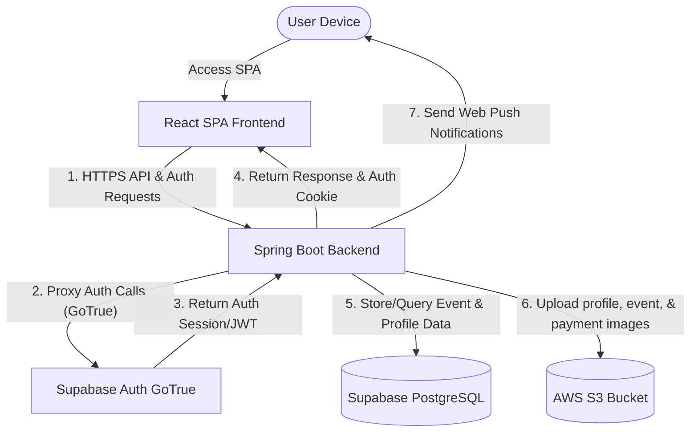
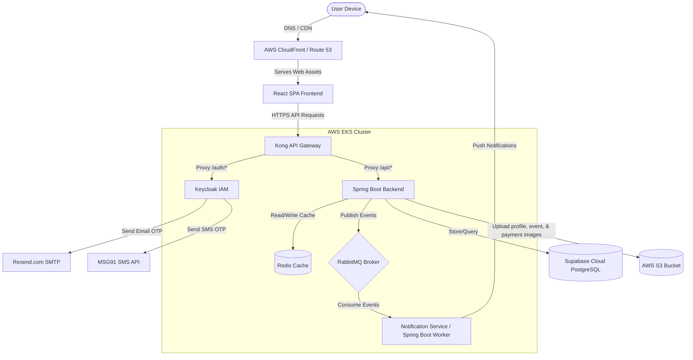
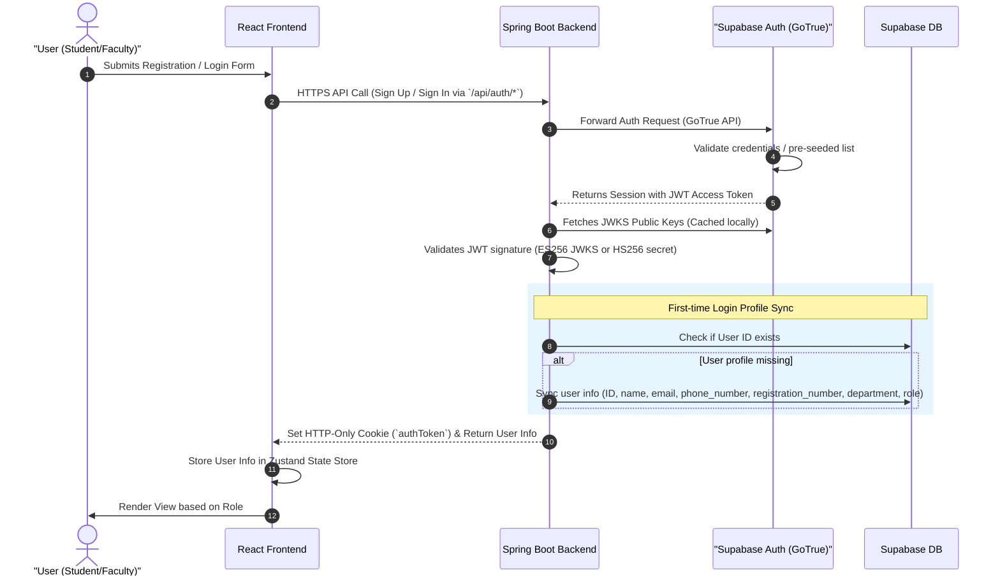
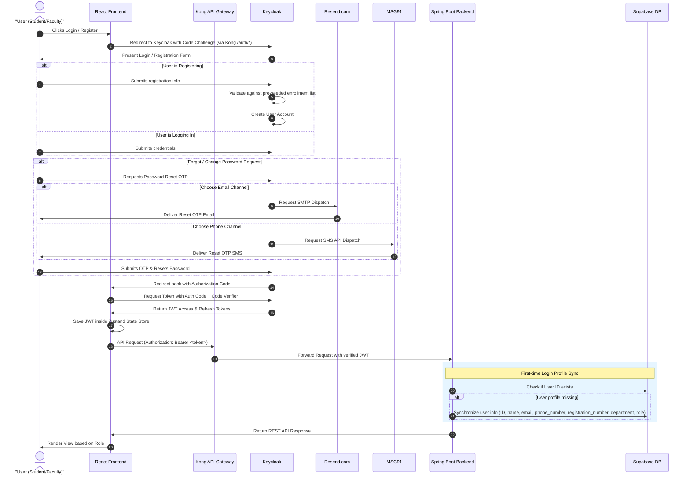

# High-Level Design (HLD)

## 1. Cross-System Architecture & Topology

The application utilizes a decoupled client-server architecture. To support a phased deployment, the topology evolves from a direct client-server model in Version 1 to a fully managed Kubernetes cluster in Version 2.

### 1.1 Version 1 Lightweight Architecture (Current Scope)

In Version 1, the infrastructure architecture is simplified to reduce complexity, while the underlying code writing styles are fully structured. The React SPA (built on a strict **3-Tier Architecture**) communicates directly with the Spring Boot backend (organized via a decoupled **Ports & Adapters** architecture). Authentication is delegated to Supabase Auth, while user profile data and relations are stored in Supabase PostgreSQL. User profile images, event assets (posters, banners, event photos), and payment transaction screenshots are uploaded directly from Spring Boot to AWS S3.

#### V1 Infrastructure Components:
*   **Hosting:** Frontend assets (compiled React package) are hosted in a basic static file hosting service (e.g. AWS S3 + CloudFront).
*   **Backend Server:** The Spring Boot backend runs on a standard virtual server (e.g. AWS EC2, Elastic Beanstalk, or a simple container runner).
*   **Identity & Database:** Supabase Cloud hosts both the GoTrue Authentication provider and the PostgreSQL Database.
*   **Object Storage:** A dedicated AWS S3 bucket stores user profile images, event assets (banners, posters, event photos), and UPI verification screenshots.
*   **Notifications:** Delivered asynchronously using Java thread pools (`@Async` task executors) within the Spring Boot application (no RabbitMQ broker).

---

### 1.2 Version 2 Enterprise Architecture (Future Scope)

Version 2 introduces enterprise scaling and high availability. Services are hosted within an AWS Elastic Kubernetes Service (EKS) cluster. The Kong API Gateway handles routing, Keycloak acts as the Identity Provider, Redis caches high-frequency queries, and RabbitMQ processes asynchronous notifications.

#### V2 Infrastructure Components:
*   **EKS Kubernetes Deployments:** Deployed via Helm charts using isolated deployment configurations (`values-dev.yaml` and `values-prod.yaml`).
*   **Kong Gateway Entry Point:** Routes external traffic, intercepts `/auth/*` paths to Keycloak, and routes `/api/*` to Spring Boot backend services.
*   **Message Broker (RabbitMQ):** Handles event-driven decoupling and queuing of notification dispatches.
*   **In-Memory Caching (Redis):** Caches frequent queries (like event listings) and handles temporary rate-limiting.
*   **Federated Identity (Keycloak):** Performs OAuth 2.0 PKCE authentication with SMTP/SMS OTP dispatches.

---

## 2. Authentication Flow

### 2.1 Version 1 Authentication Flow (Supabase Auth)

In V1, authentication is managed directly by the frontend and Supabase Auth. The Spring Boot backend acts as a Resource Server validating incoming Supabase JWT tokens.

1.  **Proxied Login/Registration:** Frontend routes auth calls directly to the Spring Boot `/api/auth` proxy controllers. The backend invokes Supabase GoTrue REST endpoints on behalf of the client and retrieves the JWT session token.
2.  **JWT Cookie Injection & Verification:** Spring Boot sets the token inside an HTTP-only security cookie (`authToken`) on the response. For subsequent requests, the `SupabaseJwtFilter` extracts the JWT from the cookie (or the `Authorization` header), validates the signature symmetrically (using the local secret key) or asymmetrically (using Supabase JWKS endpoints), and sets the security context.
3.  **Profile Sync:** On first login, Spring Boot checks the local DB and creates a user profile row containing attributes derived from JWT claims.

---

### 2.2 Version 2 Authentication Flow (OAuth 2.0 + PKCE via Keycloak)

In V2, Keycloak manages authentication via Authorization Code Flow with PKCE behind the Kong Gateway.

---

## 3. Web Push Notification Architecture

PWA notifications are native and run independently of external notification engines (like Firebase Cloud Messaging) using Service Workers.

*   **VAPID Key Pair:** A cryptographic signature pair. The public key is exposed on the frontend, and the private key is held securely by the Spring Boot backend.
*   **Subscription Flow:**
    1.  The user authorizes notification prompts in the browser.
    2.  The Service Worker registers a push subscription using the public VAPID key.
    3.  The subscription object (containing endpoint and keys) is saved in Supabase via Spring Boot backend APIs.
*   **Dispatch Flow:**
    1.  When a waiting list student is promoted (either to `CONFIRMED` or `PENDING_PAYMENT`), or a coordinator publishes a new event, Spring Boot fetches the targeted user's subscription record.
    2.  In V1, Spring Boot signs the payload and dispatches it directly and asynchronously via standard `@Async` methods. In V2, the dispatch event is put on a RabbitMQ queue, and a separate worker service processes the queues to send web push notifications via the browser's push service.
    3.  The push service wakes up the client Service Worker, displaying an OS-level notification popup.

---

## 4. Reference Documents
For detailed user interaction flows, styling tokens, and frontend architecture constraints, see the [User Flow and UI Development Documentation](user-flow-docs.md).
