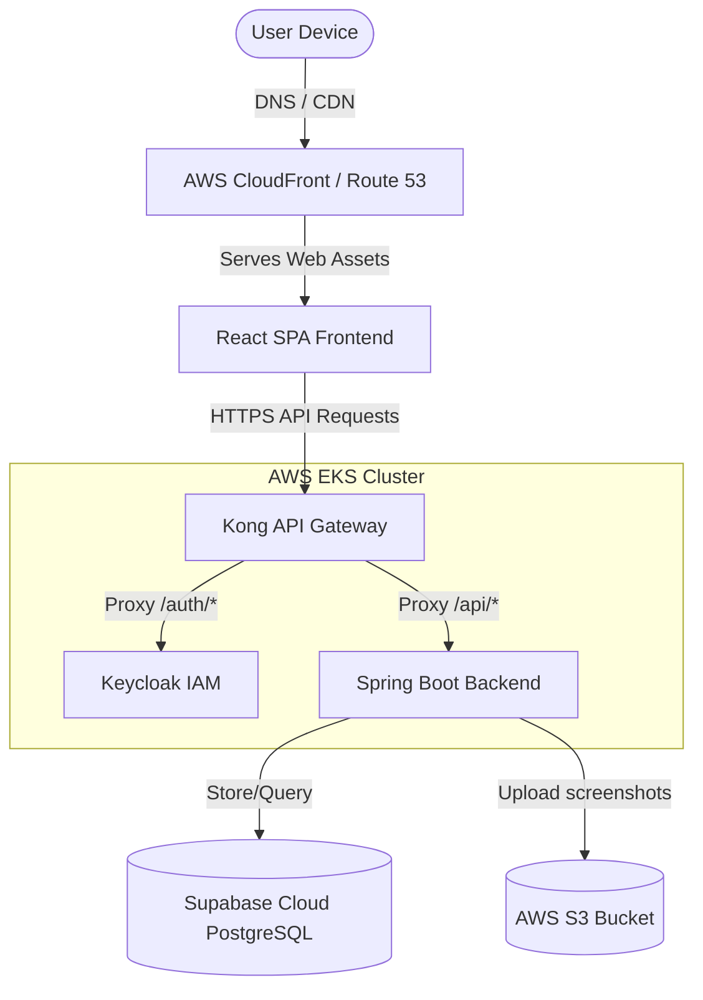
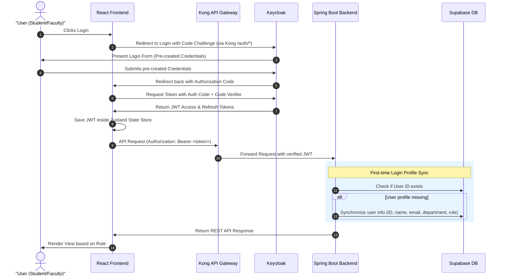

# High-Level Design (HLD)

## 1. Cross-System Architecture & Topology

The application utilizes a decoupled client-server architecture. The frontend is hosted as a static Single Page Application (SPA), while the APIs and Identity Management are managed inside an AWS Elastic Kubernetes Service (EKS) cluster. 

### 1.1 Infrastructure Components
*   **DNS & CDN Hosting:** Frontend assets (compiled React package) are hosted in AWS S3 and served through AWS CloudFront to reduce latency. Route 53 routes domains to the CloudFront distribution and the Kong API Gateway entry point.
*   **Infrastructure as Code (IaC):** Terraform scripts provision the network subnets (VPC), Route 53 DNS records, the S3 bucket for screenshots, and the EKS clusters.
*   **EKS Kubernetes Deployments:** Deployed via Helm charts using isolated deployment configurations (`values-dev.yaml` and `values-prod.yaml`).
*   **Managed Database:** PostgreSQL schemas are provisioned and hosted on managed Supabase Cloud.

---

## 2. Authentication Flow (OAuth 2.0 + PKCE)

To secure user access, the application implements the **Authorization Code Flow with Proof Key for Code Exchange (PKCE)**. 

### 2.1 Role Creation & Assignment Flow
1.  **Account Pre-creation:** The System Admin pre-creates Keycloak user logins for students and faculty.
2.  **SPOC Assignment:** The Admin assigns the `SPOC` role to specific faculty members in Keycloak and binds them to a specific department in the database.
3.  **Coordinator Promotion:** Department SPOCs use a dashboard to assign coordinator roles to users within their department (demanding `FACULTY_COORDINATOR` or `STUDENT_COORDINATOR` mappings depending on profile type).

### 2.2 Networking & Security Boundaries
1.  **Kong Gateway Integration:** All API calls target Kong. It intercepts `/auth/*` and forwards requests to Keycloak, and routes `/api/*` to the Spring Boot cluster.
2.  **JWT Verification:** Spring Boot serves as an OAuth2 Resource Server. It validates the signature of incoming JWTs against Keycloak's public keys.

---

## 3. Web Push Notification Architecture

PWA notifications are native and run independently of external notification engines (like Firebase Cloud Messaging) using Service Workers.

*   **VAPID Key Pair:** A cryptographic signature pair. The public key is exposed on the frontend, and the private key is held securely by the Spring Boot backend.
*   **Subscription Flow:**
    1.  The user authorizes notification prompts in the browser.
    2.  The Service Worker registers a push subscription using the public VAPID key.
    3.  The subscription object (containing endpoint and keys) is saved in Supabase via Spring Boot backend APIs.
*   **Dispatch Flow:**
    1.  When a waiting list student is promoted (either to `CONFIRMED` or `PENDING_PAYMENT`), or a coordinator publishes a new event, Spring Boot fetches the targeted user's subscription record.
    2.  The backend signs a payload with the private VAPID key and sends it to the browser's web push service.
    3.  The push service wakes up the client Service Worker, displaying an OS-level notification popup.

