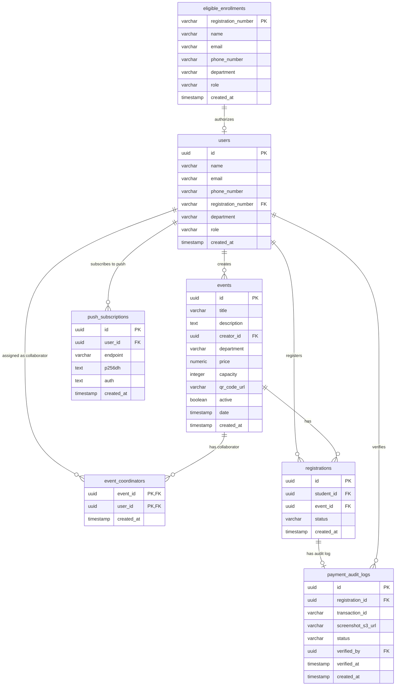

# Low-Level Design (LLD)

## 1. Database Schema & ER Diagram

The PostgreSQL database (Supabase) stores user profiles, event details, registrations, manual payment verification history, and browser push notification endpoints.



### 1.1 Integrity Rules
*   **Users:** User profiles self-registered. Registration number must exist in the `eligible_enrollments` table and cannot be duplicated. User roles (`STUDENT`, `FACULTY`, `ADMIN`) are synced on registration based on the matching enrollment record.
*   **Registrations:** Status transitions:
    *   *Free events:* Immediate slot available: `CONFIRMED`. No slot: `WAITING_LIST` -> `CONFIRMED` (upon cancellation dropout promotion).
    *   *Paid events:* Immediate slot: `PENDING_PAYMENT_VERIFICATION` -> `CONFIRMED` or `REJECTED`. No slot: `WAITING_LIST` -> `PENDING_PAYMENT` (upon cancellation promotion) -> `PENDING_PAYMENT_VERIFICATION` -> `CONFIRMED` or `REJECTED` (or `PAYMENT_REJECTED` if re-upload allowed).
    *   *24-Hour Expiry:* Promoted waiting list registrations in `PENDING_PAYMENT` status automatically transition to `EXPIRED` if payment details are not submitted within 24 hours.
    *   *12-Hour Re-upload Expiry:* Registrations transitioned to `PAYMENT_REJECTED` automatically transition to `EXPIRED` if valid payment details are not re-submitted within 12 hours from rejection.
*   **Capacity Constraint:** Active reservation slots count (registrations in `CONFIRMED` or `PENDING_PAYMENT_VERIFICATION` state) must not exceed the event `capacity`.

---

## 2. High-Concurrency Slot Control Strategy

To prevent overselling of ticket inventories and manage the FCFS waiting list queue under concurrent spikes, the Spring Boot transaction executes a row-level write lock.

### 2.1 Backend Registration Flow (Locking)
```java
@Transactional
public RegistrationResponse registerForEvent(UUID eventId, UUID studentId) {
    // 1. Validate user eligibility (Only student roles are allowed to register)
    User user = userRepository.findById(studentId)
        .orElseThrow(() -> new ResourceNotFoundException("User not found"));
    if (!user.getRole().equals("STUDENT") && !user.getRole().equals("STUDENT_COORDINATOR")) {
        throw new UnauthorizedException("Only students are eligible to register for events.");
    }

    // 2. Lock the event row for updates
    Event event = eventRepository.findByIdForUpdate(eventId)
        .orElseThrow(() -> new ResourceNotFoundException("Event not found"));

    // 3. Count active confirmed/pending reservations
    long activeReservations = registrationRepository.countActiveReservations(eventId);

    Registration registration = new Registration();
    registration.setStudentId(studentId);
    registration.setEvent(event);

    if (activeReservations < event.getCapacity()) {
        if (event.getPrice().compareTo(BigDecimal.ZERO) == 0) {
            registration.setStatus(RegistrationStatus.CONFIRMED);
        } else {
            registration.setStatus(RegistrationStatus.PENDING_PAYMENT_VERIFICATION);
        }
    } else {
        registration.setStatus(RegistrationStatus.WAITING_LIST);
    }
    
    return registrationRepository.save(registration);
}
```

### 2.2 Backend Dropout Promotion Flow (Locking)
```java
@Transactional
public void cancelRegistration(UUID registrationId, UUID requestingUserId) {
    // 1. Lock registration being cancelled
    Registration registration = registrationRepository.findByIdForUpdate(registrationId)
        .orElseThrow(() -> new ResourceNotFoundException("Registration not found"));
    
    // Authorization check: student owner or assigned event collaborator
    validateCancellationAuthority(registration, requestingUserId);

    UUID eventId = registration.getEvent().getId();
    Event event = eventRepository.findByIdForUpdate(eventId)
        .orElseThrow(() -> new ResourceNotFoundException("Event not found"));

    // 2. Cancel the registration
    registration.setStatus(RegistrationStatus.CANCELLED);
    registrationRepository.save(registration);

    // 3. Look for the oldest WAITING_LIST student
    Optional<Registration> oldestWaiting = registrationRepository
        .findFirstByEventIdAndStatusOrderByCreatedAtAsc(eventId, RegistrationStatus.WAITING_LIST);

    if (oldestWaiting.isPresent()) {
        Registration waiting = oldestWaiting.get();
        if (event.getPrice().compareTo(BigDecimal.ZERO) == 0) {
            waiting.setStatus(RegistrationStatus.CONFIRMED);
            // Trigger Service Worker push alert for confirmation
        } else {
            waiting.setStatus(RegistrationStatus.PENDING_PAYMENT);
            // Trigger Service Worker push alert prompting payment upload
        }
        registrationRepository.save(waiting);
    }
}
```
*   **SQL query triggered:** `SELECT * FROM events WHERE id = ? FOR UPDATE;`
*   **Isolation level:** Spring Boot default `READ_COMMITTED` isolation level, which ensures row write locks serialize updates.

---

## 3. React Frontend 3-Layer Architecture

The frontend workspace separates concerns into strict decoupled folders:

```
frontend/src/
├── api/          # Layer 1: Raw fetch/HTTP API operations
├── stores/       # Layer 2: Zustand stores and data logic
└── pages/        # Layer 3: View components and routing views
```

1.  **API Layer (`src/api/`):** Contains raw network fetch calls. A custom fetch helper appends authentication headers dynamically:
    ```typescript
    export const apiFetch = async (endpoint: string, options: RequestInit = {}) => {
      const token = useAuthStore.getState().token;
      const headers: HeadersInit = {
        'Content-Type': 'application/json',
        ...options.headers,
        ...(token ? { Authorization: `Bearer ${token}` } : {}),
      };
      return fetch(`/api${endpoint}`, { ...options, headers });
    };
    ```
2.  **Data Layer (`src/stores/`):** Manages local state. Stores handle transformations and update views (e.g., `useEventsStore.ts`, `useAuthStore.ts`, `useRegistrationStore.ts`).
3.  **View Layer (`src/pages/`, `src/components/`):** Component views styled with Tailwind CSS v4 and HeroUI elements. Employs maroon red branding (`#a80000`) and uses HeroUI's skeleton components for asynchronous loading states.

---

## 4. API Schema Specifications

### 4.1 Create Event (Faculty Coordinators only)
*   **Path:** `POST /api/events`
*   **Headers:** `Authorization: Bearer <jwt-token>`
*   **Request JSON:**
    ```json
    {
      "title": "Hackathon 2026",
      "description": "Annual college coding contest.",
      "price": 250.00,
      "capacity": 150,
      "date": "2026-10-15T09:00:00Z"
    }
    ```
*   **Response JSON (201 Created):**
    ```json
    {
      "id": "e4b2d8c3-12ab-4bcd-8ef0-1234567890ab",
      "title": "Hackathon 2026",
      "price": 250.00,
      "capacity": 150,
      "active": true
    }
    ```

### 4.2 Assign Event Collaborator (Creator or SPOC only)
*   **Path:** `POST /api/events/{eventId}/coordinators`
*   **Headers:** `Authorization: Bearer <jwt-token>`
*   **Request JSON:**
    ```json
    {
      "userId": "d7b2d8c3-12ab-4bcd-8ef0-1234567890cd"
    }
    ```
*   **Response JSON (200 OK):**
    ```json
    {
      "eventId": "e4b2d8c3-12ab-4bcd-8ef0-1234567890ab",
      "userId": "d7b2d8c3-12ab-4bcd-8ef0-1234567890cd",
      "status": "COLLABORATOR_ASSIGNED"
    }
    ```

### 4.3 Register for Event (Free or Paid)
*   **Path:** `POST /api/events/{eventId}/register`
*   **Headers:** `Authorization: Bearer <jwt-token>`
*   **Response JSON (201 Created - Slot Available, Free Event):**
    ```json
    {
      "registrationId": "r9a8c7b6-54de-4f32-ba98-76543210fedc",
      "status": "CONFIRMED"
    }
    ```
*   **Response JSON (201 Created - Slot Full, joins Waiting List):**
    ```json
    {
      "registrationId": "r9a8c7b6-54de-4f32-ba98-76543210fedc",
      "status": "WAITING_LIST"
    }
    ```
*   **Response JSON (201 Created - Slot Available, Paid Event):**
    ```json
    {
      "registrationId": "r9a8c7b6-54de-4f32-ba98-76543210fedc",
      "status": "PENDING_PAYMENT_SUBMISSION"
    }
    ```

### 4.4 Submit Payment Details (For initial booking or waiting list promotions)
*   **Path:** `POST /api/registrations/{registrationId}/submit-payment`
*   **Headers:** `Authorization: Bearer <jwt-token>`
*   **Content-Type:** `multipart/form-data`
*   **Request Parts:**
    *   `transactionId` (text): `123456789012`
    *   `screenshot` (file): Binary image file (JPEG/PNG, max 5MB)
*   **Response JSON (202 Accepted):**
    ```json
    {
      "registrationId": "r9a8c7b6-54de-4f32-ba98-76543210fedc",
      "status": "PENDING_PAYMENT_VERIFICATION",
      "screenshotUrl": "https://pec-events-screenshots.s3.amazonaws.com/r9a8c7b6.png"
    }
    ```

### 4.5 Cancel Registration / Dropout
*   **Path:** `POST /api/registrations/{registrationId}/cancel`
*   **Headers:** `Authorization: Bearer <jwt-token>`
*   **Response JSON (200 OK):**
    ```json
    {
      "registrationId": "r9a8c7b6-54de-4f32-ba98-76543210fedc",
      "status": "CANCELLED",
      "message": "Registration cancelled. Queue processed."
    }
    ```

### 4.6 Verify Payment (Coordinators)
*   **Path:** `POST /api/registrations/{registrationId}/verify`
*   **Headers:** `Authorization: Bearer <jwt-token>`
*   **Request JSON:**
    ```json
    {
      "approved": true,
      "rejectionReason": ""
    }
    ```
*   **Response JSON (200 OK - Approved):**
    ```json
    {
      "registrationId": "r9a8c7b6-54de-4f32-ba98-76543210fedc",
      "status": "CONFIRMED",
      "message": "Payment verified successfully. Registration is confirmed."
    }
    ```
*   **Response JSON (200 OK - Rejected for Re-upload):**
    ```json
    {
      "registrationId": "r9a8c7b6-54de-4f32-ba98-76543210fedc",
      "status": "PAYMENT_REJECTED",
      "message": "Payment details rejected: Invalid transaction reference. Student has 12 hours to re-upload details."
    }
    ```

### 4.7 Create SPOC (Admin only)
*   **Path:** `POST /api/admin/spocs`
*   **Headers:** `Authorization: Bearer <jwt-token>`
*   **Request JSON:**
    ```json
    {
      "userId": "u1a2b3c4-56de-78fa-9012-34567890abcd",
      "department": "CSE"
    }
    ```
*   **Response JSON (201 Created):**
    ```json
    {
      "userId": "u1a2b3c4-56de-78fa-9012-34567890abcd",
      "department": "CSE",
      "role": "SPOC"
    }
    ```

### 4.8 Promote Coordinator (SPOC only)
*   **Path:** `POST /api/spoc/coordinators`
*   **Headers:** `Authorization: Bearer <jwt-token>`
*   **Request JSON:**
    ```json
    {
      "userId": "u5f6g7h8-90ij-klmn-opqr-stuvwxyz1234",
      "action": "PROMOTE"
    }
    ```
*   **Response JSON (200 OK):**
    ```json
    {
      "userId": "u5f6g7h8-90ij-klmn-opqr-stuvwxyz1234",
      "role": "STUDENT_COORDINATOR",
      "status": "PROMOTED"
    }
    ```

### 4.9 User Self-Registration
Self-registration is orchestrated on Keycloak-hosted pages behind the Kong Gateway. Once the user submits their registration form, Keycloak guides the user through the following sequential verification flow before generating the account:

1. **Email OTP Verification Screen:** Keycloak generates an OTP and sends it via the Resend.com SMTP relay. Keycloak displays the Email verification screen.
2. **Phone/SMS OTP Verification Screen:** Upon email verification success, Keycloak generates a second OTP and dispatches it via Twilio SMS. Keycloak displays the Phone verification screen.
3. **Account Creation & Redirect:** Once both OTPs are successfully validated, Keycloak registers the user and redirects back to the SPA.

If utilizing a direct self-registration endpoint via the Kong Gateway (for custom headless signup interfaces), the registration follows a multi-step verification:

*   **Step 1: Submit Details & Request Email OTP**
    *   **Path:** `POST /api/auth/register/initiate`
    *   **Request JSON:**
        ```json
        {
          "registrationNumber": "PEC12345",
          "email": "student@pec.edu",
          "phoneNumber": "+919876543210",
          "name": "Jane Doe",
          "password": "securepassword123"
        }
        ```
    *   **Response JSON (202 Accepted):**
        ```json
        {
          "sessionToken": "reg_session_abc123",
          "emailVerified": false,
          "phoneVerified": false,
          "message": "Registration initiated. Email OTP sent."
        }
        ```

*   **Step 2: Verify Email OTP & Request Phone OTP**
    *   **Path:** `POST /api/auth/register/verify-email`
    *   **Request JSON:**
        ```json
        {
          "sessionToken": "reg_session_abc123",
          "otp": "123456"
        }
        ```
    *   **Response JSON (200 OK):**
        ```json
        {
          "sessionToken": "reg_session_abc123",
          "emailVerified": true,
          "phoneVerified": false,
          "message": "Email verified. Phone SMS OTP sent."
        }
        ```

*   **Step 3: Verify Phone OTP & Finalize Registration**
    *   **Path:** `POST /api/auth/register/verify-phone`
    *   **Request JSON:**
        ```json
        {
          "sessionToken": "reg_session_abc123",
          "otp": "654321"
        }
        ```
    *   **Response JSON (201 Created):**
        ```json
        {
          "userId": "u5f6g7h8-90ij-klmn-opqr-stuvwxyz1234",
          "registrationNumber": "PEC12345",
          "status": "REGISTERED"
        }
        ```

*   **Response JSON (409 Conflict - Registration Number Exists):**
    ```json
    {
      "errorCode": "REGISTRATION_NUMBER_EXISTS",
      "message": "Registration number already exists. Redirecting to login."
    }
    ```

## 5. Redis Caching Specification
To sustain high concurrency workloads (6,000 users), active event endpoints utilize Redis caching.

### 5.1 Cache Eviction and Key Invalidation Strategy
- **Key Designations:**
  - `events::list` -> Caches the list of all active/upcoming events.
  - `events::detail::{eventId}` -> Caches event details by ID.
- **Cache Eviction Rules:**
  - Cache is populated (`@Cacheable`) upon reading `GET /api/events` or `GET /api/events/{id}`.
  - Cache is evicted (`@CacheEvict`) upon any of the following write operations:
    - Admin/SPOC/Coordinator publishes or updates an event (`POST /api/events`, `PUT /api/events/{id}`).
    - A seat booking status updates to `CONFIRMED` or `PENDING_PAYMENT_VERIFICATION` (updates capacity count).
    - A registration is cancelled, expired, or rejected.

---

## 6. RabbitMQ Messaging Specification
To prevent slow network I/O from blocking transactions, notification dispatches are managed asynchronously via RabbitMQ.

### 6.1 Exchanges, Queues, and Routing Configuration
- **Exchange:** `pec.events.exchange` (Type: `topic`)
- **Queue:** `pec.notifications.queue` (Durable: `true`)
- **Routing Keys:**
  - `event.published` -> Sent when a new event is posted.
  - `registration.status.updated` -> Sent when a registration status updates (e.g., promoted, confirmed, rejected).

### 6.2 Message Payloads

#### Event Published Message
```json
{
  "eventId": "e4b2d8c3-12ab-4bcd-8ef0-1234567890ab",
  "title": "Hackathon 2026",
  "action": "PUBLISHED"
}
```

#### Registration Status Update Message
```json
{
  "registrationId": "r9a8c7b6-54de-4f32-ba98-76543210fedc",
  "studentId": "u5f6g7h8-90ij-klmn-opqr-stuvwxyz1234",
  "status": "PENDING_PAYMENT",
  "details": "Promoted from waiting list. 24 hours to submit payment."
}
```

---

## 7. Reference Documents
For detailed user interaction flows, styling tokens, and frontend architecture constraints, see the [User Flow and UI Development Documentation](user-flow-docs.md).
