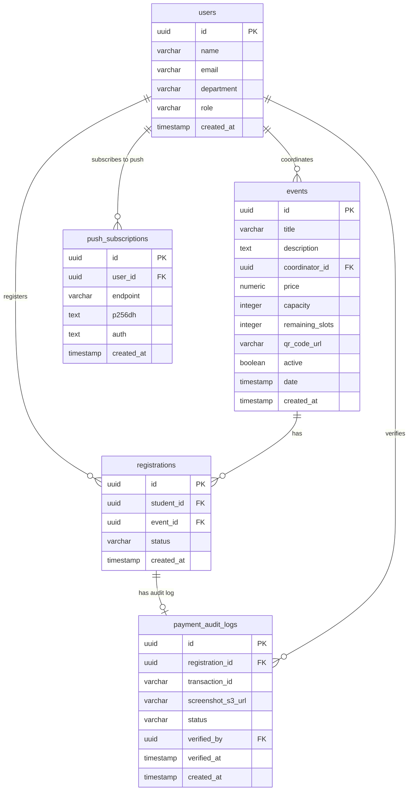

# Low-Level Design (LLD)

## 1. Database Schema & ER Diagram

The PostgreSQL database (Supabase) stores user profiles, event details, registrations, manual payment verification history, and browser push notification endpoints.



### 1.1 Integrity Rules
*   **Users:** Read-only reference populated automatically when the user first signs in via Keycloak.
*   **Registrations:** Status is governed by state transitions:
    *   *Free events:* Immediately transitions to `CONFIRMED`.
    *   *Paid events:* Transitions: `PENDING_PAYMENT_VERIFICATION` → `CONFIRMED` or `REJECTED`.
*   **Remaining Slots Constraint:** `remaining_slots` on the `events` table must not drop below zero (`CHECK (remaining_slots >= 0)`).

---

## 2. High-Concurrency Slot Control Strategy

To prevent overselling of ticket inventories under concurrent spikes, the Spring Boot transaction executes a row-level write lock.

### 2.1 Backend Locking Flow
```java
@Transactional
public RegistrationResponse registerForEvent(UUID eventId, UUID studentId) {
    // 1. Lock the event row for updates
    Event event = eventRepository.findByIdForUpdate(eventId)
        .orElseThrow(() -> new ResourceNotFoundException("Event not found"));

    // 2. Validate seat availability
    if (event.getRemainingSlots() <= 0) {
        throw new SoldOutException("This event has run out of seats.");
    }

    // 3. Decrement slot (only for free events; paid events decrement upon coordinator approval)
    if (event.getPrice().compareTo(BigDecimal.ZERO) == 0) {
        event.setRemainingSlots(event.getRemainingSlots() - 1);
        eventRepository.save(event);
    }
    
    // 4. Complete and save registration details...
}
```
*   **SQL query triggered:** `SELECT id, remaining_slots, capacity FROM events WHERE id = ? FOR UPDATE;`
*   **Isolation level:** Spring Boot utilizes the database default `READ_COMMITTED` isolation level, which respects row-level blocking lock queues.

---

## 3. React Frontend 3-Layer Architecture

The frontend workspace separates concerns into strict decoupled folders:

```
frontend/src/
├── api/          # Layer 1: Raw fetch/HTTP API operations
├── stores/       # Layer 2: Zustand stores and data logic
└── pages/        # Layer 3: View components and routing views
```

1.  **API Layer (`src/api/`):** Contains raw network fetch calls. Axios instances append authentication headers dynamically:
    ```typescript
    const api = axios.create({ baseURL: '/api' });
    api.interceptors.request.use((config) => {
      const token = useAuthStore.getState().token;
      if (token) {
        config.headers.Authorization = `Bearer ${token}`;
      }
      return config;
    });
    ```
2.  **Data Layer (`src/stores/`):** Manages local state. Stores handle transformations and update views (e.g., `useEventsStore.ts`, `useAuthStore.ts`, `useRegistrationStore.ts`).
3.  **View Layer (`src/pages/`, `src/components/`):** Component views styled with Tailwind CSS v4 and HeroUI elements. Employs maroon red branding (`#a80000`) and uses HeroUI's skeleton components for asynchronous loading states.

---

## 4. API Schema Specifications

### 4.1 Create Event
*   **Path:** `POST /api/events`
*   **Headers:** `Authorization: Bearer <jwt-token>`
*   **Request JSON:**
    ```json
    {
      "title": "Hackathon 2026",
      "description": "Annual college coding contest.",
      "price": 250.00,
      "capacity": 150,
      "date": "2026-10-15T09:00:00Z"
    }
    ```
*   **Response JSON (201 Created):**
    ```json
    {
      "id": "e4b2d8c3-12ab-4bcd-8ef0-1234567890ab",
      "title": "Hackathon 2026",
      "price": 250.00,
      "capacity": 150,
      "remaining_slots": 150,
      "active": true
    }
    ```

### 4.2 Register for Paid Event
*   **Path:** `POST /api/events/{eventId}/register`
*   **Headers:** `Authorization: Bearer <jwt-token>`
*   **Content-Type:** `multipart/form-data`
*   **Request Parts:**
    *   `transactionId` (text): `123456789012` (12-digit transaction ID string)
    *   `screenshot` (file): Binary image file (JPEG/PNG, max 5MB)
*   **Response JSON (202 Accepted):**
    ```json
    {
      "registrationId": "r9a8c7b6-54de-4f32-ba98-76543210fedc",
      "status": "PENDING_PAYMENT_VERIFICATION",
      "screenshotUrl": "https://pec-events-screenshots.s3.amazonaws.com/r9a8c7b6.png"
    }
    ```

### 4.3 Verify Payment (Coordinators)
*   **Path:** `POST /api/registrations/{registrationId}/verify`
*   **Headers:** `Authorization: Bearer <jwt-token>`
*   **Request JSON:**
    ```json
    {
      "approved": true,
      "rejectionReason": ""
    }
    ```
*   **Response JSON (200 OK):**
    ```json
    {
      "registrationId": "r9a8c7b6-54de-4f32-ba98-76543210fedc",
      "status": "CONFIRMED",
      "message": "Payment verified successfully. Registration is confirmed."
    }
    ```
