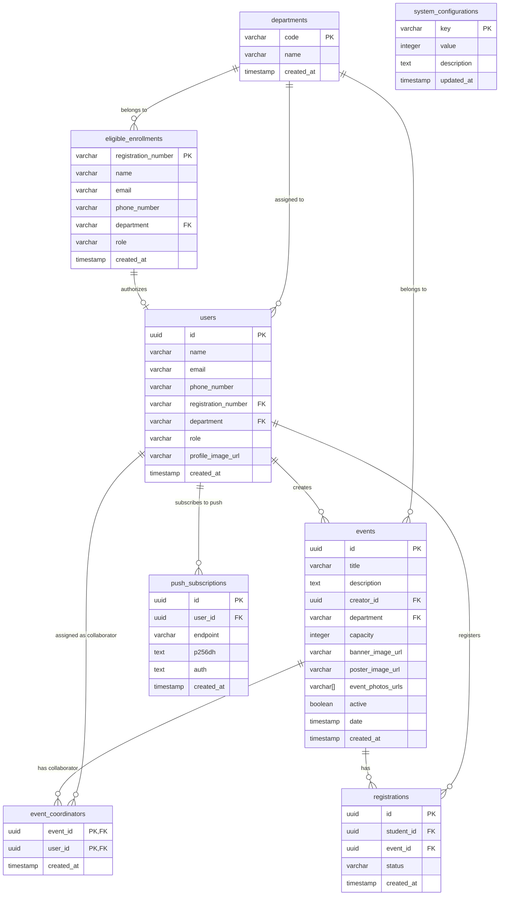

# Low-Level Design (LLD)

## 1. Database Schema & ER Diagram

The PostgreSQL database stores user profiles, departments, configurations, event details, registrations, manual payment verification history, and browser push notification endpoints.



### 1.1 Integrity Rules
*   **Departments:** All user records, eligible enrollments, and events must point to valid department codes registered in the `departments` table.
*   **Users:** User profiles self-registered. Registration number must exist in the `eligible_enrollments` table and cannot be duplicated. User roles are synced on registration based on the matching enrollment record.
*   **Coordinators Limits:** Department SPOCs promote/create coordinator roles within their department, subject to maximum quotas (default 1 SPOC, 3 Faculty Coordinators, 3 Student Coordinators per department) defined in the `system_configurations` table. Database trigger blocks actions exceeding these limits.
*   **Registrations:** Status transitions:
    *   *Free events (All events):* Immediate slot available: `CONFIRMED`. No slot: `WAITING_LIST` -> `CONFIRMED` (upon cancellation dropout promotion).
*   **Capacity Constraint:** Active reservation slots count (registrations in the `CONFIRMED` state) must not exceed the event `capacity`.

---

## 2. High-Concurrency Slot Control Strategy

To prevent overselling of ticket inventories and manage the FCFS waiting list queue under concurrent spikes, the Spring Boot transaction executes a row-level write lock.

### 2.1 Backend Registration Flow (Locking)
```java
@Transactional
public RegistrationResponse registerForEvent(UUID eventId, UUID studentId) {
    // 1. Validate user eligibility (Only student roles are allowed to register)
    User user = userRepository.findById(studentId)
        .orElseThrow(() -> new ResourceNotFoundException("User not found"));
    if (!user.getRole().equals("STUDENT") && !user.getRole().equals("STUDENT_COORDINATOR")) {
        throw new UnauthorizedException("Only students are eligible to register for events.");
    }

    // 2. Lock the event row for updates
    Event event = eventRepository.findByIdForUpdate(eventId)
        .orElseThrow(() -> new ResourceNotFoundException("Event not found"));

    // 3. Count active confirmed/pending reservations
    long activeReservations = registrationRepository.countActiveReservations(eventId);

    Registration registration = new Registration();
    registration.setStudentId(studentId);
    registration.setEvent(event);

    if (activeReservations < event.getCapacity()) {
        if (event.getPrice().compareTo(BigDecimal.ZERO) == 0) {
            registration.setStatus(RegistrationStatus.CONFIRMED);
    } else {
        registration.setStatus(RegistrationStatus.WAITING_LIST);
    }
    
    return registrationRepository.save(registration);
}
```

### 2.2 Backend Dropout Promotion Flow (Locking)
```java
@Transactional
public void cancelRegistration(UUID registrationId, UUID requestingUserId) {
    // 1. Lock registration being cancelled
    Registration registration = registrationRepository.findByIdForUpdate(registrationId)
        .orElseThrow(() -> new ResourceNotFoundException("Registration not found"));
    
    // Authorization check: student owner or assigned event collaborator
    validateCancellationAuthority(registration, requestingUserId);

    UUID eventId = registration.getEvent().getId();
    Event event = eventRepository.findByIdForUpdate(eventId)
        .orElseThrow(() -> new ResourceNotFoundException("Event not found"));

    // 2. Cancel the registration
    registration.setStatus(RegistrationStatus.CANCELLED);
    registrationRepository.save(registration);

    // 3. Look for the oldest WAITING_LIST student
    Optional<Registration> oldestWaiting = registrationRepository
        .findFirstByEventIdAndStatusOrderByCreatedAtAsc(eventId, RegistrationStatus.WAITING_LIST);

    if (oldestWaiting.isPresent()) {
        Registration waiting = oldestWaiting.get();
        waiting.setStatus(RegistrationStatus.CONFIRMED);
        // Trigger Service Worker push alert for confirmation
        registrationRepository.save(waiting);
    }
}
```
*   **SQL query triggered:** `SELECT * FROM events WHERE id = ? FOR UPDATE;`
*   **Isolation level:** Spring Boot default `READ_COMMITTED` isolation level, which ensures row write locks serialize updates.

---

## 2.3 Version 1 Security & Authentication Filter Design

In Version 1, the Spring Boot application authenticates incoming requests using a custom servlet filter that validates Supabase JWT signatures, and enforces permissions using AOP aspects.

### 2.3.1 Supabase JWT Authentication Filter (`SupabaseJwtFilter`)

Every request (excluding `/auth/**`, `/health`, `/error`, and Swagger UI documentation endpoints) is intercepted by `SupabaseJwtFilter` extending `OncePerRequestFilter`:

1. **Token Extraction**: The filter checks the `Authorization` header for a `Bearer <token>` pattern. If not present, it attempts to read the token from an `authToken` cookie.
2. **Algorithm and Key Resolution**:
   - Decodes the header of the JWT to retrieve the `alg` (signature algorithm) and `kid` (key identifier) claims.
   - **Asymmetric Signature (ES256)**: If the algorithm is `ES256`, the filter contacts the Supabase JWKS endpoint (`https://<supabase-project-id>.supabase.co/auth/v1/.well-known/jwks.json`) to fetch the public key corresponding to the `kid`. Public keys are parsed and stored in a thread-safe cache (`ConcurrentHashMap<String, PublicKey>`) to minimize network hops on subsequent requests.
   - **Symmetric Signature (HS256)**: If the algorithm is HMAC-SHA based, it retrieves the shared JWT secret (`supabase.jwt-secret`) configured in the application environment properties.
3. **Claims Verification**:
   - Validates the token signature and checks expiration.
   - Extracts payload claims: `sub` (assigned to user ID), `email`, and `phone`.
   - Binds these fields as attributes on the `HttpServletRequest` (`userId`, `email`, `phone`).
   - Registers a `UsernamePasswordAuthenticationToken` containing the user ID in Spring Security's `SecurityContextHolder` to complete request authentication.

### 2.3.2 Role-Based Aspect Enforcement (`@RequiresRole` & `RoleCheckAspect`)

Endpoint authorizations are checked using method-level or class-level `@RequiresRole` annotations:

1. **AOP Interception**: `RoleCheckAspect` executes `@Before` method invocations annotated with `@RequiresRole` (or methods inside classes carrying the annotation).
2. **Context Resolution**: The aspect retrieves the authenticated `userId` from the servlet request attributes. If missing, it throws an HTTP `401 Unauthorized` exception.
3. **Database Role Lookup**: The aspect queries a database-backed service:
   ```java
   String userRole = roleService.getRoleForUser(userId); // Checks 'users' table role column
   ```
4. **Access Verification**:
   - Compares the returned user role against the set of allowed roles defined in `@RequiresRole({"role1", "role2"})`.
   - If a match is found, processing continues. Otherwise, throws an HTTP `403 Forbidden` exception (`ResponseStatusException`).

---

## 2.4 Spring Boot Backend Architecture & Directory Layout

To enforce modularity, maintainability, and clean separation of concerns, the Spring Boot application is organized using a **Ports & Adapters (Hexagonal)** style package structure:

### 2.4.1 Package Structure

```
backend/src/main/java/<package-root>/
├── annotation/      # Custom annotations (e.g., @RequiresRole)
├── aspect/          # AspectJ interceptors (e.g., RoleCheckAspect)
├── config/          # Configurations (Security, Cache, S3, Supabase/Keycloak properties)
├── filter/          # Custom Servlet Filters (e.g., SupabaseJwtFilter)
├── controller/      # API entry points (adapters)
│   ├── admin/       # Admin-specific endpoint classes
│   ├── student/     # Student/Participant-specific endpoints
│   ├── coordinator/ # Event management and verification endpoints
│   ├── shared/      # Auth, health, and common endpoints
│   └── advice/      # GlobalExceptionHandler for HTTP response formatting
├── service/         # Core business logic implementations
│   └── port/        # Service interfaces defining ports (e.g., EventServicePort)
├── repository/      # Spring Data JPA repositories
└── model/           # Domain models and representations
    ├── entity/      # Database JPA entity models
    ├── dto/         # Request/Response Data Transfer Objects
    ├── enums/       # Common domain enumerations
    └── converter/   # AttributeConverters for custom database type mappings
```

### 2.4.2 Port & Adapter Boundaries
- **Adapters**: Controllers, JWT filters, and schedulers act as input adapters. They consume incoming requests, parse payloads, and delegate execution to core service ports.
- **Ports (Interfaces)**: Service ports in `service/port/` declare the required business capability without exposing implementation specifics.
- **Domain Logic**: Implemented in concrete classes inside `service/` that handle transactional boundaries (`@Transactional`) and interact with database-backed repositories.

### 2.4.3 Environment-Specific Configuration Scenarios
The application relies on profile-driven configuration to separate local development from cloud environments safely:
*   **Scenario A: Local Development (Default)**: Evaluates the default properties block of the multi-document `application.yaml` to connect to a local PostgreSQL instance (default port `54322`, username/password `postgres`).
*   **Scenario B: Cloud Deployment**: Activated with the `aws` profile. The application fetches its configuration parameters (such as live JDBC strings and Supabase keys) dynamically from AWS Secrets Manager using Spring Cloud AWS integration.

### 2.4.4 Local Testing Emulators
To enable complete offline capability:
*   **Object Storage**: A local MinIO container emulates AWS S3 uploads for user profile images, event assets (banners, posters, event photos), and payment screenshots (configured on port `9000` with local key-pair mock credentials).
*   **Email and OTP Catcher**: Outgoing mails are captured locally using a mock SMTP service (Inbucket on port `54324`), allowing testing of magic links or OTPs from a local inbox UI.

---

## 3. React Frontend 3-Tier Architecture

The frontend workspace separates concerns into strict decoupled layers to ensure high testability, clean boundaries, and modularity:

```
frontend/src/
├── api/             # Layer 3: Raw network clients and API types
├── services/        # Layer 3: Domain services, Strategy Pattern implementations
├── hooks/           # Layer 2: Feature-specific custom hooks (forms, validations)
├── stores/          # Layer 2: Zustand global stores
├── data/            # Layer 2: Static configurations and helper data
├── components/      # Layer 1: Reusable/presentational components
└── pages/           # Layer 1: Page-level view presentation and routing layouts
```

### 3.1 Layer Responsibilities & Engineering Rules

#### 1. View Layer (`src/components/`, `src/components/ui/`, `src/pages/`)
- **Purpose**: Pure visual rendering and user interaction interface.
- **Technologies**: React 19, HeroUI v3 components, Tailwind CSS v4.
- **Engineering Rules**:
  - **No Direct API Calls**: Presentation components MUST NOT import or invoke files from `src/api/`, `axios`, or raw endpoint functions directly.
  - **No Complex Business Logic**: Keep components presentational. UI form states, data transformations, validations, and action dispatchers must live in custom hooks or stores.
  - **Reusability**: Smaller UI components should be highly reusable, single-responsibility, and type-safe via strict TypeScript interfaces.

#### 2. Data & State Layer (`src/hooks/`, `src/stores/`, `src/data/`)
- **Purpose**: UI form state management, validation logic, input formatting, and global application state.
- **Technologies**: Custom React Hooks, Zustand, static constants.
- **Engineering Rules**:
  - **Custom Hooks for Features**: Feature-specific complex state (e.g., forms, wizard flows, inputs validation) must be encapsulated in hooks.
  - **Zustand for Global State**: Store system-wide state (such as the authenticated session, active theme, global notifications) in Zustand stores.
  - **Decoupling**: Business calculations and parsing must reside in hooks or helper functions, keeping view components lightweight.

#### 3. API & Service Layer (`src/services/`, `src/api/`)
- **Purpose**: API interaction, HTTP requests, domain logic services, strategy selection, and request/response formatting.
- **Technologies**: Axios, custom REST adapters, Strategy Pattern registries.
- **Engineering Rules**:
  - **Strategy Pattern for Extensibility**: Use strategy registries for features that branch dynamically based on roles (Student vs. Coordinator), events, or types. Adding a strategy must never modify the core control flow.
  - **Axios Isolation**: Raw network requests and REST endpoint/types definitions reside exclusively inside `src/api/`.
  - **No UI Imports**: Files in this layer must never import React, hooks, or visual components.

### 3.2 Testing Standards (`src/**/__tests__/`)
- **Framework**: Vitest (configured with `happy-dom` and `setupTests.ts`).
- **Structure**: Tests are co-located in `__tests__/` subdirectories under their respective layer (e.g., `src/api/__tests__/`, `src/components/__tests__/`).
- **Approach**: Adhere to the docs-first testing process (STLC lifecycle).

---

## 4. API Schema Specifications

### 4.1 Create Event Draft (Student or Faculty Coordinators)
*   **Path:** `POST /api/events`
*   **Headers:** `Authorization: Bearer <jwt-token>`
*   **Request JSON:**
    ```json
    {
      "title": "Hackathon 2026",
      "description": "Annual college coding contest.",
      "price": 250.00,
      "capacity": 150,
      "date": "2026-10-15T09:00:00Z"
    }
    ```
*   **Response JSON (201 Created):**
    ```json
    {
      "id": "e4b2d8c3-12ab-4bcd-8ef0-1234567890ab",
      "title": "Hackathon 2026",
      "price": 250.00,
      "capacity": 150,
      "status": "DRAFT",
      "active": false
    }
    ```

### 4.1b Publish Event (Faculty Coordinators or SPOC only)
*   **Path:** `POST /api/events/{eventId}/publish`
*   **Headers:** `Authorization: Bearer <jwt-token>`
*   **Response JSON (200 OK):**
    ```json
    {
      "id": "e4b2d8c3-12ab-4bcd-8ef0-1234567890ab",
      "title": "Hackathon 2026",
      "status": "PUBLISHED",
      "active": true
    }
    ```

### 4.2 Assign Event Collaborator (Creator or SPOC only)
*   **Path:** `POST /api/events/{eventId}/coordinators`
*   **Headers:** `Authorization: Bearer <jwt-token>`
*   **Request JSON:**
    ```json
    {
      "userId": "d7b2d8c3-12ab-4bcd-8ef0-1234567890cd"
    }
    ```
*   **Response JSON (200 OK):**
    ```json
    {
      "eventId": "e4b2d8c3-12ab-4bcd-8ef0-1234567890ab",
      "userId": "d7b2d8c3-12ab-4bcd-8ef0-1234567890cd",
      "status": "COLLABORATOR_ASSIGNED"
    }
    ```

### 4.3 Register for Event
*   **Path:** `POST /api/events/{eventId}/register`
*   **Headers:** `Authorization: Bearer <jwt-token>`
*   **Response JSON (201 Created - Slot Available):**
    ```json
    {
      "registrationId": "r9a8c7b6-54de-4f32-ba98-76543210fedc",
      "status": "CONFIRMED"
    }
    ```
*   **Response JSON (201 Created - Slot Full, joins Waiting List):**
    ```json
    {
      "registrationId": "r9a8c7b6-54de-4f32-ba98-76543210fedc",
      "status": "WAITING_LIST"
    }
    ```

### 4.4 Cancel Registration / Dropout
*   **Path:** `POST /api/registrations/{registrationId}/cancel`
*   **Headers:** `Authorization: Bearer <jwt-token>`
*   **Response JSON (200 OK):**
    ```json
    {
      "registrationId": "r9a8c7b6-54de-4f32-ba98-76543210fedc",
      "status": "CANCELLED",
      "message": "Registration cancelled successfully. FCFS queue processed."
    }
    ```

### 4.7 Create SPOC (Admin only)
*   **Path:** `POST /api/admin/spocs`
*   **Headers:** `Authorization: Bearer <jwt-token>`
*   **Request JSON:**
    ```json
    {
      "userId": "u1a2b3c4-56de-78fa-9012-34567890abcd",
      "department": "CSE",
      "dummyPassword": "tempPassword123"
    }
    ```
*   **Response JSON (201 Created):**
    ```json
    {
      "userId": "u1a2b3c4-56de-78fa-9012-34567890abcd",
      "department": "CSE",
      "role": "SPOC",
      "message": "SPOC created with dummy password."
    }
    ```

### 4.8 Promote Coordinator (SPOC only)
*   **Path:** `POST /api/spoc/coordinators`
*   **Headers:** `Authorization: Bearer <jwt-token>`
*   **Request JSON:**
    ```json
    {
      "userId": "u5f6g7h8-90ij-klmn-opqr-stuvwxyz1234",
      "action": "PROMOTE",
      "dummyPassword": "coordTempPassword456"
    }
    ```
*   **Response JSON (200 OK):**
    ```json
    {
      "userId": "u5f6g7h8-90ij-klmn-opqr-stuvwxyz1234",
      "role": "STUDENT_COORDINATOR",
      "status": "PROMOTED",
      "message": "Coordinator promoted with dummy password."
    }
    ```

### 4.9 User Self-Registration
- **Phase 1 (V1)**: Self-registration is orchestrated in the React frontend calling the Spring Boot backend API `/api/auth/register` (which validates user credentials against the database and creates the user in Supabase Auth via GoTrue admin API).
- **Phase 2 (V2)**: Self-registration is orchestrated on Keycloak-hosted pages behind the Kong Gateway. Once the user submits their registration form, Keycloak validates the user credentials against the pre-seeded enrollment list (no OTP is sent during registration) and registers the account.


*   **Direct Headless Self-Registration Endpoint**
    *   **Path:** `POST /api/auth/register`
    *   **Request JSON:**
        ```json
        {
          "registrationNumber": "PEC12345",
          "email": "student@pec.edu",
          "phoneNumber": "+919876543210",
          "name": "Jane Doe",
          "password": "securepassword123"
        }
        ```
    *   **Response JSON (201 Created):**
        ```json
        {
          "userId": "u5f6g7h8-90ij-klmn-opqr-stuvwxyz1234",
          "registrationNumber": "PEC12345",
          "status": "REGISTERED"
        }
        ```
        ```
        {
          "errorCode": "REGISTRATION_NUMBER_EXISTS",
          "message": "Registration number already exists. Redirecting to login."
        }
        ```

*   **Direct Headless Login Endpoint**
    *   **Path:** `POST /api/auth/login`
    *   **Request JSON:**
        ```json
        {
          "email": "student@pec.edu",
          "password": "securepassword123"
        }
        ```
    *   **Response JSON (200 OK):**
        ```json
        {
          "userId": "u5f6g7h8-90ij-klmn-opqr-stuvwxyz1234",
          "name": "Jane Doe",
          "email": "student@pec.edu",
          "role": "STUDENT",
          "department": "CSE",
          "registrationNumber": "PEC12345",
          "accessToken": "jwt_token_string"
        }
        ```
    *   **Response Headers:**
        `Set-Cookie: authToken=jwt_token_string; HttpOnly; Secure; SameSite=Lax; Path=/; Max-Age=2592000`

*   **Logout Endpoint**
    *   **Path:** `POST /api/auth/logout`
    *   **Response JSON (200 OK):**
        ```json
        {
          "message": "Logged out successfully"
        }
        ```
    *   **Response Headers:**
        `Set-Cookie: authToken=; HttpOnly; Secure; SameSite=Lax; Path=/; Max-Age=0`

*   **Role-Based Status Check Endpoint**
    *   **Path:** `GET /api/auth/me`
    *   **Headers:** `Cookie: authToken=jwt_token_string` or `Authorization: Bearer jwt_token_string`
    *   **Response JSON (200 OK):**
        ```json
        {
          "userId": "u5f6g7h8-90ij-klmn-opqr-stuvwxyz1234",
          "name": "Jane Doe",
          "email": "student@pec.edu",
          "role": "STUDENT",
          "department": "CSE",
          "registrationNumber": "PEC12345"
        }
        ```

### 4.10 Credentials Administration & OTP Actions

*   **Request Password Reset / Recovery OTP (Single OTP)**
    *   **Path:** `POST /api/auth/password/forgot`
    *   **Request JSON:**
        ```json
        {
          "identity": "student@pec.edu",
          "channel": "EMAIL"
        }
        ```
    *   **Response JSON (200 OK):**
        ```json
        {
          "message": "Reset OTP dispatched via selected channel.",
          "sessionToken": "reset_session_xyz789"
        }
        ```

*   **Verify OTP & Update Password**
    *   **Path:** `POST /api/auth/password/reset`
    *   **Request JSON:**
        ```json
        {
          "sessionToken": "reset_session_xyz789",
          "otp": "123456",
          "newPassword": "newSecurePassword456"
        }
        ```
    *   **Response JSON (200 OK):**
        ```json
        {
          "status": "PASSWORD_UPDATED",
          "message": "Password successfully updated."
        }
        ```

## 5. Redis Caching Specification (Phase 2 / V2 Only)
To sustain high concurrency workloads (6,000 users) in Version 2, active event endpoints utilize Redis caching. In Version 1, these endpoints perform direct PostgreSQL queries.

### 5.1 Cache Eviction and Key Invalidation Strategy (V2)
- **Key Designations:**
  - `events::list` -> Caches the list of all active/upcoming events.
  - `events::detail::{eventId}` -> Caches event details by ID.
- **Cache Eviction Rules:**
  - Cache is populated (`@Cacheable`) upon reading `GET /api/events` or `GET /api/events/{id}`.
  - Cache is evicted (`@CacheEvict`) upon any of the following write operations:
    - Admin/SPOC/Coordinator publishes or updates an event (`POST /api/events`, `PUT /api/events/{id}`).
    - A seat booking status updates to `CONFIRMED` or `PENDING_PAYMENT_VERIFICATION` (updates capacity count).
    - A registration is cancelled, expired, or rejected.

---

## 6. RabbitMQ Messaging Specification (Phase 2 / V2 Only)
To prevent slow network I/O from blocking transactions, notification dispatches are managed asynchronously via RabbitMQ.

### 6.1 Exchanges, Queues, and Routing Configuration
- **Exchange:** `pec.events.exchange` (Type: `topic`)
- **Queue:** `pec.notifications.queue` (Durable: `true`)
- **Routing Keys:**
  - `event.published` -> Sent when a new event is posted.
  - `registration.status.updated` -> Sent when a registration status updates (e.g., promoted, confirmed, rejected).

### 6.2 Message Payloads

#### Event Published Message
```json
{
  "eventId": "e4b2d8c3-12ab-4bcd-8ef0-1234567890ab",
  "title": "Hackathon 2026",
  "action": "PUBLISHED"
}
```

#### Registration Status Update Message
```json
{
  "registrationId": "r9a8c7b6-54de-4f32-ba98-76543210fedc",
  "studentId": "u5f6g7h8-90ij-klmn-opqr-stuvwxyz1234",
  "status": "PENDING_PAYMENT",
  "details": "Promoted from waiting list. 24 hours to submit payment."
}
```

---

## 7. Reference Documents
For detailed user interaction flows, styling tokens, and frontend architecture constraints, see the [User Flow and UI Development Documentation](user-flow-docs.md).
