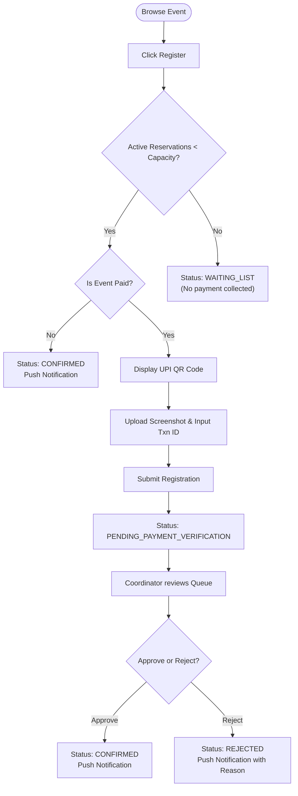
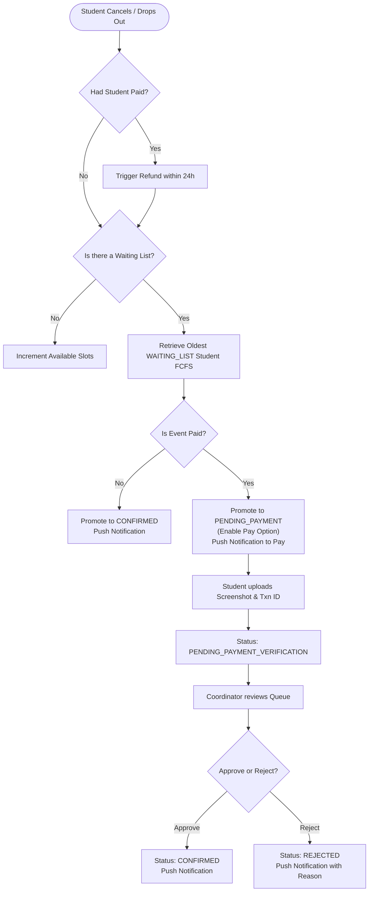

# Product Requirements Document (PRD)

## 1. Scope of Features

### 1.1 User Registration & Profile Synchronization
*   **Authentication & Self-Registration Portal:** 
    - **Phase 1 (V1)**: Supabase Auth (GoTrue) coordinates authentication. The React frontend never accesses Supabase directly. Users register or log in via the Spring Boot `/auth` proxy API by providing registration number, email, phone number, and password, which the backend forwards to Supabase on the server side.
    - **Phase 2 (V2)**: Keycloak coordinates authentication. Users redirect to Keycloak portals exposed behind the Kong Gateway.
*   **Self-Registration Verification:** 
    - **Phase 1 (V1)**: Registration number, email, and phone number are validated during registration against a pre-seeded enrollment list. If the registration number is already in use, the user is redirected to the login screen.
    - **Phase 2 (V2)**: keycloak validates parameters against the enrollment list.
*   **Single OTP for Password Operations:** 
    - **Phase 1 (V1)**: A single OTP (sent via email SMTP or SMS using MSG91 Send SMS Auth Hook) is used exclusively for password resets and recovery.
    - **Phase 2 (V2)**: Keycloak realm dispatches single OTPs via Resend.com SMTP relay or MSG91 SMS custom SPI.
*   **Automatic Profile Sync:** 
    - **Phase 1 (V1) & Phase 2 (V2)**: On first successful login, the frontend sends the authenticated JWT bearer token. If the user does not exist in the database, the backend creates a user profile mapping `id`, `name`, `email`, `phone_number`, `registration_number`, `department`, and `role`.
*   **Database Caching & Decoupling (V2 Only):** 
    - **Phase 2 (V2) Redis Caching**: High-concurrency event discovery requests (listing and detail queries) are cached in Redis to decrease response times and prevent PostgreSQL database connection limits from being saturated during peaks. (No caching/Redis in V1).
    - **Phase 2 (V2) RabbitMQ Message Queue**: Decouples the main transactional thread from I/O heavy notification dispatches. Status changes publish events to RabbitMQ, where a consumer consumes and executes Web Push alerts asynchronously. (In V1, notifications are executed in simple Spring `@Async` threads).

### 1.2 Event Listing & Discovery
*   **Discovery Board:** Authenticated students and faculty can browse and view active/upcoming events.
*   **Metadata Display:** Events display title, banner image, date, description, coordinator details, price, remaining seats, and registration deadline.

### 1.3 Event Creation (Coordinators)
*   **Event Creation & Publishing Interface:** Both Student and Faculty Coordinators can create events (saved as drafts). However, to prevent miscommunication and ensure safety, only Faculty Coordinators and department SPOCs have the authority to publish events.
*   **Collaborative Management:** When creating an event, the creator (Student or Faculty Coordinator) is marked as the creator. The creator (or their department SPOC) can assign other Faculty or Student Coordinators of their department as collaborators on the event. Student Coordinators do NOT have permissions to manage (add or remove) collaborators on the event.
*   **Event Modification:** Any coordinator assigned to an event has full modification permissions to edit details, manage registrations, and verify payments.
*   **Parameters:** Configurable capacity limits, price, active flags, UPI payment details, and event assets (banners, posters, event photos).
*   **Overbooking Control:** Enforce strict capacity caps using Postgres row-level locks when seat allocations or registrations occur.

### 1.4 Ticket Booking & Payment Submission (V1)
*   **Eligibility Boundary:** Only student roles (`STUDENT` and `STUDENT_COORDINATOR`) are eligible to register and participate in events. Faculty roles (`FACULTY`, `FACULTY_COORDINATOR`, and `SPOC`) can browse and view events but are blocked from registering/participating.
*   **Capacity Checks:** The system counts active reservations as registrations in `CONFIRMED` or `PENDING_PAYMENT_VERIFICATION` states. If this count is equal to or greater than the event's capacity, new registrations are placed in the `WAITING_LIST` state.
*   **Free Events:**

    *   *Slots Available:* Immediate registration. Status is set to `CONFIRMED`.
    *   *Slots Full:* Registration is placed in `WAITING_LIST`.
*   **Paid Events:**
    *   *Slots Available:* Clicking register opens a modal showing a static UPI QR code. The student must scan/pay external to the app, input the 12-digit UPI Reference Transaction ID, and upload the payment screenshot. Upon submission, they are placed in `PENDING_PAYMENT_VERIFICATION` status.
    *   *Slots Full:* The pay option is disabled. Clicking register places the student on the `WAITING_LIST` immediately. No payment details or screenshots are collected upfront.
*   **Refund Policy for Cancellations:** If a student cancels their registration after paying (when the status is `PENDING_PAYMENT_VERIFICATION` or `CONFIRMED`), they can select "Cancel Registration", and their paid amount will be refunded within 24 hours.
*   **Image & Asset Storage:** The system utilizes AWS S3 for storage. The frontend sends user profile images, event assets (banners, posters, event photos), and payment confirmation screenshots to the Spring Boot backend, which uploads them to AWS S3 and stores their URLs in the database.

### 1.5 Verification Dashboard
*   **Review Queue:** Assigned coordinators see registrations filtered by status (`PENDING_PAYMENT_VERIFICATION`, `CONFIRMED`, `REJECTED`, `PENDING_PAYMENT`, `WAITING_LIST`).
*   **Validation Modal:** Clicking a registration in `PENDING_PAYMENT_VERIFICATION` opens a modal showing the student details, transaction ID, and the uploaded S3 payment screenshot.
*   **Actions:**
    *   **Approve:** Updates status to `CONFIRMED`, and pushes a confirmation notification to the student.
    *   **Reject:** Updates status to `REJECTED`, prompts for a reason, and pushes a rejection notification to the student.

### 1.6 Web Push Notifications (PWA)
*   **Subscription Opt-in:** Prompt the user to grant push permission. If granted, register a service worker subscription with a public VAPID key and send it to the backend.
*   **Status Alerts:** Push OS-level notifications immediately when:
    *   A coordinator publishes a new event.
    *   A registration status updates to `CONFIRMED`, `REJECTED`, or `PENDING_PAYMENT`.

### 1.7 FCFS Waiting List & Dropout Flow (V1)
*   **Dropout Cancellation:** When a student cancels their registration (or a coordinator cancels it), if they have already paid (status was `PENDING_PAYMENT_VERIFICATION` or `CONFIRMED`), a refund is triggered to be processed within 24 hours. If the event has a waiting list (one or more registrations in `WAITING_LIST` state), the oldest `WAITING_LIST` registration (based on `created_at` ASC) is automatically promoted:
    *   *Free Event:* Promoted registration status changes to `CONFIRMED`. Send success push notification.
    *   *Paid Event:* Promoted registration status changes to `PENDING_PAYMENT`. Send push notification requesting payment.
    *   *No Waiting List:* Available slots are incremented by 1.
*   **Promoted Payment Submission & Expiry:** A student whose registration transitions to `PENDING_PAYMENT` is prompted to pay (the pay option becomes active exclusively for them, while remaining disabled for all other waiting list users). They scan the UPI QR code, pay, and upload their transaction ID and payment screenshot. This transitions their registration status to `PENDING_PAYMENT_VERIFICATION` for coordinator approval.
    *   *24-Hour Expiry Window:* The promoted student has exactly **24 hours** from the promotion timestamp to submit their transaction details and screenshot. If they do not upload payment details within 24 hours, their registration status is updated to `EXPIRED` (or cancelled) and the backend automatically triggers the promotion of the next FCFS waiting list student.
    *   *Payment Rejection & Re-upload Grace Period:* If a coordinator rejects a student's uploaded payment details, the registration status transitions to `PAYMENT_REJECTED` and a push notification is sent to the student. The student is granted a **12-hour grace period** from the rejection timestamp to re-upload valid payment details. If they fail to re-submit details within 12 hours, the registration is updated to `EXPIRED` and the backend automatically promotes the next student in the FCFS waiting list queue.

## 2. Core User Flows

### 2.1 Event Registration Flow

### 2.2 Student Dropout & Promotion Flow

## 3. Product Constraints & System Parameters
*   **Max Upload Size:** Screenshots must be constrained to 5MB, limited to `.png`, `.jpg`, and `.jpeg` formats.
*   **UPI Reference Format:** Restrict the transaction ID input to a 12-digit numeric format.
*   **Skeleton Loading:** Use HeroUI skeletons during data fetch delays to enhance user experience.
*   **Architectural Foundations:** Enforce a strict 3-Tier React Frontend architecture and Spring Boot Ports & Adapters backend architecture from Phase 1 (V1) to maintain consistency as the application scales to Enterprise Phase 2 (V2).

---

## 4. Reference Documents
For detailed user interaction flows, styling tokens, and frontend architecture constraints, see the [User Flow and UI Development Documentation](user-flow-docs.md).
