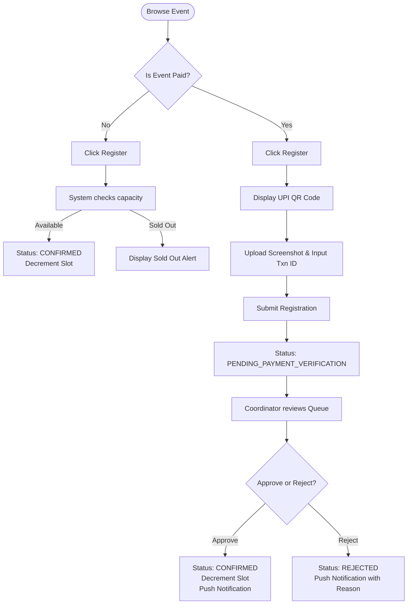

# Product Requirements Document (PRD)

## 1. Scope of Features

### 1.1 User Registration & Profile Synchronization
*   **Authentication Portal:** Keycloak coordinates authentication. Users can register using any email domain.
*   **Automatic Profile Sync:** On successful login, the frontend sends the JWT bearer token. If the user does not exist in the database, the backend creates a user profile mapping `id`, `name`, `email`, `department`, and `role`.

### 1.2 Event Listing & Discovery
*   **Discovery Board:** Authenticated students can view active/upcoming events.
*   **Metadata Display:** Events display title, banner image, date, description, coordinator details, price, remaining seats, and registration deadline.

### 1.3 Event Creation (Coordinators)
*   **Publishing Interface:** Coordinators (Student & Faculty) can publish events.
*   **Parameters:** Configurable capacity limits, price, active flags, and UPI payment details.
*   **Overbooking Control:** Enforce strict capacity caps using Postgres row-level locks when seat allocations occur.

### 1.4 Ticket Booking & Payment Submission (V1)
*   **Free Events:** Immediate registration. The user registers, the database decrements the event slot by 1, and the status changes to `CONFIRMED`.
*   **Paid Events:** Clicking register opens a modal showing a static UPI QR code. The student must:
    1. Scan and pay external to the app.
    2. Input the 12-digit UPI Reference Transaction ID.
    3. Upload a file of the payment screenshot.
    4. Submit registration, placing it in a `PENDING_PAYMENT_VERIFICATION` status.
*   **Image Storage:** Frontend sends files directly to the Spring Boot backend, which puts it into AWS S3 and records the S3 URL in the database.

### 1.5 Verification Dashboard
*   **Review Queue:** Coordinators see registrations filtered by status (`PENDING_PAYMENT_VERIFICATION`, `CONFIRMED`, `REJECTED`).
*   **Validation Modal:** Clicking a registration opens a modal showing the student details, transaction ID, and the uploaded S3 payment screenshot.
*   **Actions:**
    *   **Approve:** Decrements the event slot, updates status to `CONFIRMED`, and pushes a notification to the student.
    *   **Reject:** Updates status to `REJECTED`, prompts for a reason (e.g., "Transaction ID mismatch"), and pushes a rejection notification to the student.

### 1.6 Web Push Notifications (PWA)
*   **Subscription Opt-in:** Prompt the user to grant push permission. If granted, register a service worker subscription with a public VAPID key and send it to the backend.
*   **Status Alerts:** Push OS-level notifications immediately when:
    *   A coordinator publishes a new event.
    *   A registration status updates to `CONFIRMED` or `REJECTED`.

## 2. Core User Flows

## 3. Product Constraints & System Parameters
*   **Max Upload Size:** Screenshots must be constrained to 5MB, limited to `.png`, `.jpg`, and `.jpeg` formats.
*   **UPI Reference Format:** Restrict the transaction ID input to a 12-digit numeric format.
*   **Skeleton Loading:** Use HeroUI skeletons during data fetch delays to enhance user experience.
