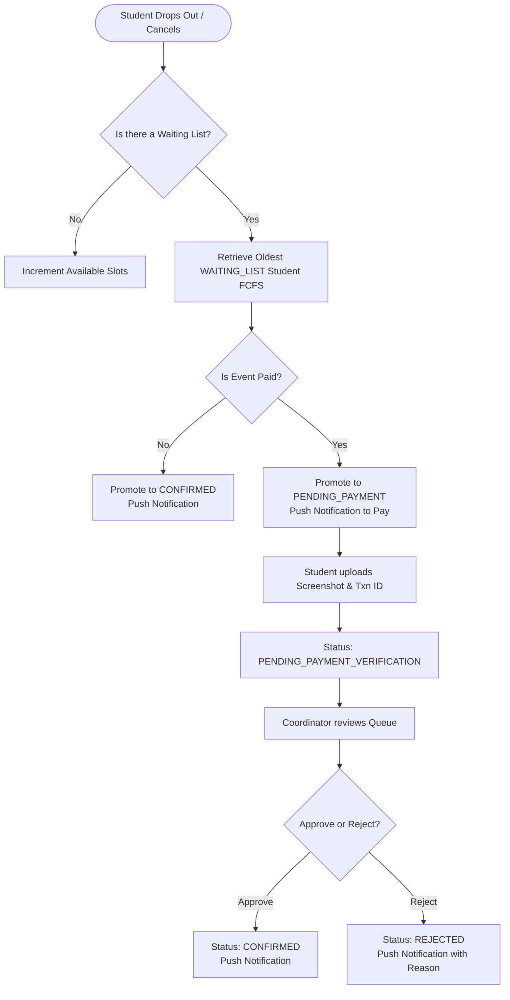

# Product Requirements Document (PRD)

## 1. Scope of Features

### 1.1 User Registration & Profile Synchronization
*   **Authentication Portal:** Keycloak coordinates authentication. Users can register using any email domain.
*   **Automatic Profile Sync:** On successful login, the frontend sends the JWT bearer token. If the user does not exist in the database, the backend creates a user profile mapping `id`, `name`, `email`, `department`, and `role`.

### 1.2 Event Listing & Discovery
*   **Discovery Board:** Authenticated students can view active/upcoming events.
*   **Metadata Display:** Events display title, banner image, date, description, coordinator details, price, remaining seats, and registration deadline.

### 1.3 Event Creation (Coordinators)
*   **Publishing Interface:** Only Faculty Coordinators can create and publish new events.
*   **Collaborative Management:** When creating an event, the Faculty Coordinator is marked as the creator. They (or other assigned coordinators) can assign other Faculty or Student Coordinators of their department as collaborators/coordinators on the event.
*   **Event Modification:** Any coordinator assigned to an event has full modification permissions to edit details, manage registrations, and verify payments.
*   **Parameters:** Configurable capacity limits, price, active flags, and UPI payment details.
*   **Overbooking Control:** Enforce strict capacity caps using Postgres row-level locks when seat allocations or registrations occur.

### 1.4 Ticket Booking & Payment Submission (V1)
*   **Capacity Checks:** The system counts active reservations as registrations in `CONFIRMED` or `PENDING_PAYMENT_VERIFICATION` states. If this count is equal to or greater than the event's capacity, new registrations are placed in the `WAITING_LIST` state.
*   **Free Events:**
    *   *Slots Available:* Immediate registration. Status is set to `CONFIRMED`.
    *   *Slots Full:* Registration is placed in `WAITING_LIST`.
*   **Paid Events:**
    *   *Slots Available:* Clicking register opens a modal showing a static UPI QR code. The student must:
        1. Scan and pay external to the app.
        2. Input the 12-digit UPI Reference Transaction ID.
        3. Upload a file of the payment screenshot.
        4. Submit registration, placing it in a `PENDING_PAYMENT_VERIFICATION` status.
    *   *Slots Full:* Clicking register places the student on the `WAITING_LIST` immediately. No payment details are requested or collected upfront to avoid refund overhead.
*   **Image Storage:** Frontend sends screenshot files directly to the Spring Boot backend, which puts it into AWS S3 and records the S3 URL in the database.

### 1.5 Verification Dashboard
*   **Review Queue:** Assigned coordinators see registrations filtered by status (`PENDING_PAYMENT_VERIFICATION`, `CONFIRMED`, `REJECTED`, `PENDING_PAYMENT`, `WAITING_LIST`).
*   **Validation Modal:** Clicking a registration in `PENDING_PAYMENT_VERIFICATION` opens a modal showing the student details, transaction ID, and the uploaded S3 payment screenshot.
*   **Actions:**
    *   **Approve:** Updates status to `CONFIRMED`, and pushes a confirmation notification to the student.
    *   **Reject:** Updates status to `REJECTED`, prompts for a reason, and pushes a rejection notification to the student.

### 1.6 Web Push Notifications (PWA)
*   **Subscription Opt-in:** Prompt the user to grant push permission. If granted, register a service worker subscription with a public VAPID key and send it to the backend.
*   **Status Alerts:** Push OS-level notifications immediately when:
    *   A coordinator publishes a new event.
    *   A registration status updates to `CONFIRMED`, `REJECTED`, or `PENDING_PAYMENT`.

### 1.7 FCFS Waiting List & Dropout Flow (V1)
*   **Dropout Cancellation:** When a student cancels their registration (or a coordinator cancels it), if the event has a waiting list (one or more registrations in `WAITING_LIST` state), the oldest `WAITING_LIST` registration (based on `created_at` ASC) is automatically promoted:
    *   *Free Event:* Promoted registration status changes to `CONFIRMED`. Send success push notification.
    *   *Paid Event:* Promoted registration status changes to `PENDING_PAYMENT`. Send push notification requesting payment.
    *   *No Waiting List:* Available slots are incremented by 1.
*   **Promoted Payment Submission:** A student whose registration transitions to `PENDING_PAYMENT` is prompted to pay. They scan the UPI QR code, pay, and upload their transaction ID and payment screenshot. This transitions their registration status to `PENDING_PAYMENT_VERIFICATION` for coordinator approval.

## 2. Core User Flows

### 2.1 Event Registration Flow

### 2.2 Student Dropout & Promotion Flow

## 3. Product Constraints & System Parameters
*   **Max Upload Size:** Screenshots must be constrained to 5MB, limited to `.png`, `.jpg`, and `.jpeg` formats.
*   **UPI Reference Format:** Restrict the transaction ID input to a 12-digit numeric format.
*   **Skeleton Loading:** Use HeroUI skeletons during data fetch delays to enhance user experience.
