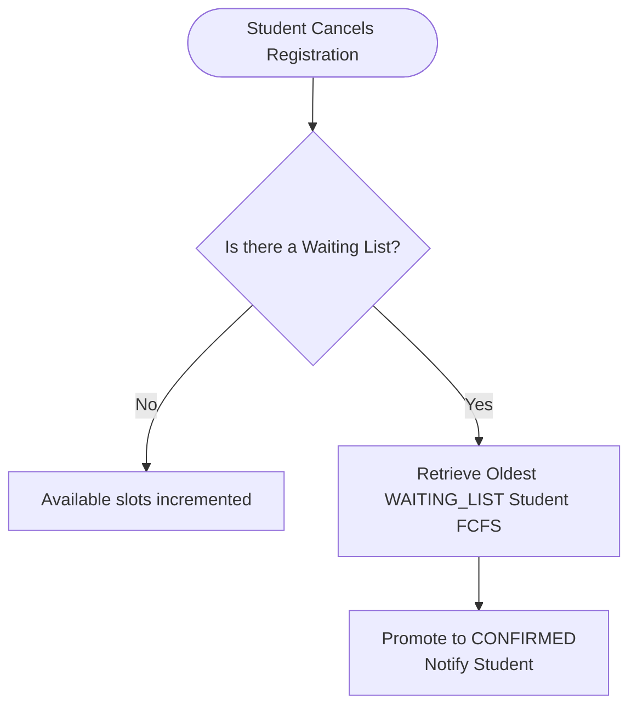

# Product Requirements Document (PRD)

## 1. Scope of Features

### 1.1 User Registration & Profile Synchronization
*   **Authentication & Self-Registration Portal:** 
    - **Phase 1 (V1)**: Supabase Auth (GoTrue) coordinates authentication. The React frontend never accesses Supabase directly. Users register or log in via the Spring Boot `/api/auth` proxy API by providing registration number, email, phone number, and password, which the backend forwards to Supabase on the server side.
    - **Phase 2 (V2)**: Keycloak coordinates authentication. Users redirect to Keycloak portals exposed behind the Kong Gateway.
*   **Self-Registration Verification:** 
    - **Phase 1 (V1)**: Registration number, email, and phone number are validated during registration against a pre-seeded enrollment list. If the registration number is already in use, the user is redirected to the login screen.
    - **Phase 2 (V2)**: keycloak validates parameters against the enrollment list.
*   **Single OTP for Password Operations:** 
    - **Phase 1 (V1)**: A single OTP (sent via email SMTP or SMS using MSG91 Send SMS Auth Hook) is used exclusively for password resets and recovery.
    - **Phase 2 (V2)**: Keycloak realm dispatches single OTPs via Resend.com SMTP relay or MSG91 SMS custom SPI.
*   **Automatic Profile Sync:** 
    - **Phase 1 (V1) & Phase 2 (V2)**: On first successful login, the frontend sends the authenticated JWT bearer token. If the user does not exist in the database, the backend creates a user profile mapping `id`, `name`, `email`, `phone_number`, `registration_number`, `department`, and `role`.
*   **Database Caching & Decoupling (V2 Only):** 
    - **Phase 2 (V2) Redis Caching**: High-concurrency event discovery requests (listing and detail queries) are cached in Redis to decrease response times and prevent PostgreSQL database connection limits from being saturated during peaks. (No caching/Redis in V1).
    - **Phase 2 (V2) RabbitMQ Message Queue**: Decouples the main transactional thread from I/O heavy notification dispatches. Status changes publish events to RabbitMQ, where a consumer consumes and executes Web Push alerts asynchronously. (In V1, notifications are executed in simple Spring `@Async` threads).

### 1.2 Event Listing & Discovery
*   **Discovery Board:** Authenticated students and faculty can browse and view active/upcoming events.
*   **Metadata Display:** Events display title, banner image, date, description, coordinator details, price, remaining seats, and registration deadline.

### 1.3 Event Creation (Draft & Publishing)
*   **Event Creation & Publishing Interface:** General Students can create events (saved as drafts). Coordinators (Faculty & Student) can create & publish events directly, and publish event drafts created by students.
*   **Collaborative Management:** When creating an event, the creator is marked as the creator. The creator (or their department SPOC) can assign other Faculty or Student Coordinators of their department as collaborators on the event.
*   **Event Modification:** Any coordinator assigned to an event has full modification permissions to edit details, manage registrations, and verify payments.
*   **Parameters:** Configurable capacity limits, price, active flags, UPI payment details, and event assets (banners, posters, event photos).
*   **Overbooking Control:** Enforce strict capacity caps using Postgres row-level locks when seat allocations or registrations occur.

#### 1.4 Ticket Booking & Registration (V1)
*   **Eligibility Boundary:** Student and Faculty (non-coordinators) and Student Coordinators are eligible to register and participate in events. Faculty Coordinators, SPOCs, and Admins are blocked from registering/participating.
*   **Capacity Checks:** The system counts active reservations as registrations in the `CONFIRMED` state. If this count is equal to or greater than the event's capacity, new registrations are placed in the `WAITING_LIST` state.
*   **Free Registrations (All events are free for the current scope):**
    *   *Slots Available:* Immediate registration. Status is set to `CONFIRMED`.
    *   *Slots Full:* Registration is placed in `WAITING_LIST`.

### 1.5 [Omitted / Ignored for V1] Verification Dashboard
*   All events are free; manual verification of UPI references or payments is not required.

### 1.6 Web Push Notifications (PWA)
*   **Subscription Opt-in:** Prompt the user to grant push permission. If granted, register a service worker subscription with a public VAPID key and send it to the backend.
*   **Status Alerts:** Push OS-level notifications immediately when:
    *   A coordinator publishes a new event.
    *   A registration status updates to `CONFIRMED` or is promoted from `WAITING_LIST`.

### 1.7 FCFS Waiting List & Dropout Flow (V1)
*   **Dropout Cancellation:** When a student cancels their registration, if the event has a waiting list (one or more registrations in the `WAITING_LIST` state), the oldest `WAITING_LIST` registration (based on `created_at` ASC) is automatically promoted:
    *   *Promotion:* Promoted registration status changes to `CONFIRMED`.
    *   *No Waiting List:* Available slots are incremented by 1.

## 2. Core User Flows

### 2.1 Event Registration Flow

### 2.2 Student Dropout & Promotion Flow

## 3. Product Constraints & System Parameters
*   **Max Upload Size:** Screenshots must be constrained to 5MB, limited to `.png`, `.jpg`, and `.jpeg` formats.
*   **UPI Reference Format:** Restrict the transaction ID input to a 12-digit numeric format.
*   **Skeleton Loading:** Use HeroUI skeletons during data fetch delays to enhance user experience.
*   **Architectural Foundations:** Enforce a strict 3-Tier React Frontend architecture and Spring Boot Ports & Adapters backend architecture from Phase 1 (V1) to maintain consistency as the application scales to Enterprise Phase 2 (V2).

---

## 4. Reference Documents
For detailed user interaction flows, styling tokens, and frontend architecture constraints, see the [User Flow and UI Development Documentation](user-flow-docs.md).
