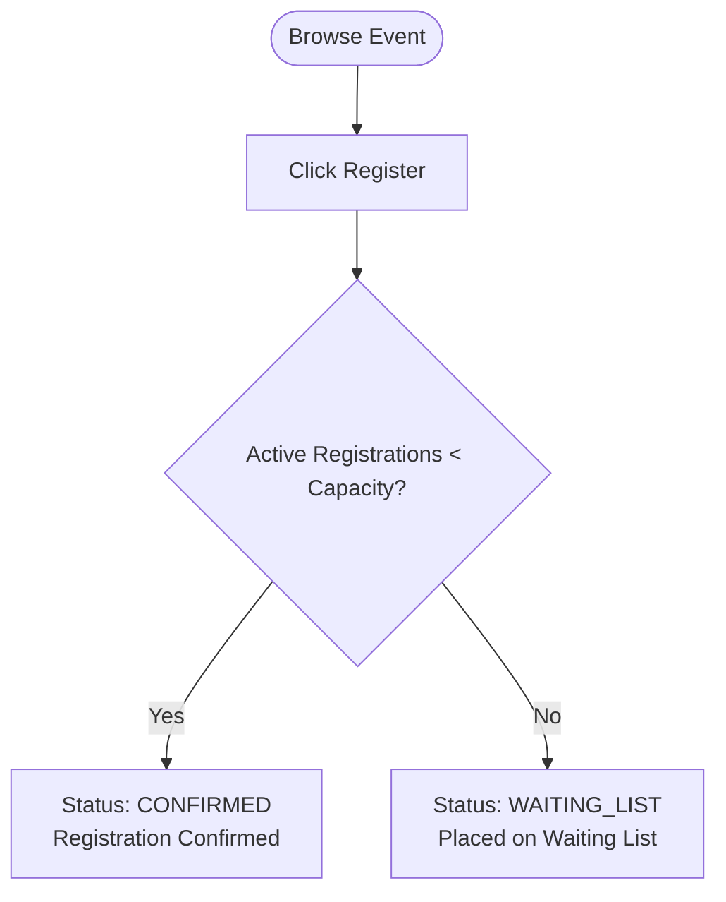

# Product Requirements Document (PRD)

## 1. Scope of Features

#### 1.1 User Registration, Authentication & Profile Management
*   **Authentication & Login Portal**:
    - Users authenticate using their credentials:
      - **Students and Student Coordinators**: Log in via **Student Registration Number** and password.
      - **SPOCs and Faculty Coordinators**: Log in via **Faculty Registration Number** and password.
      - **Admins**: Log in via **Email** and password.
    - OTP is utilized exclusively for forgot-password recovery flows.
*   **Automatic Profile Sync & Locked Fields**:
    - On first successful login, the profile details are synchronized from the Auth provider context.
    - Personal fields (`name`, `email`, `phone_number`, `profile_image_url`) are editable by the user.
    - Administrative identifier fields (`role`, `department`, `registration_number`) are strictly **locked** and cannot be modified by the user.
*   **Dynamic Department Role Constraints**:
    - The number of SPOCs, Faculty Coordinators, and Student Coordinators permitted per department is limited.
    - Default limits: `MAX_SPOCS_PER_DEPT = 1`, `MAX_FACULTY_COORDINATORS_PER_DEPT = 3`, `MAX_STUDENT_COORDINATORS_PER_DEPT = 3`.
    - These limits are stored in the database (`system_configurations` table) and dynamically configurable by the Admin.
    - Promotions/CRUD actions on user roles check and enforce these limits.
*   **Department CRUD Management**:
    - Admin can manage (Create, Read, Update, Delete) the list of academic departments (e.g. CSE, ECE, EEE, etc.).
    - System validates foreign references to departments on user and event tables.

### 1.2 Event Listing & Discovery
*   **Discovery Board:** Authenticated students and coordinators can browse and view active/upcoming events.
*   **Metadata Display:** Events display title, banner image, date, description, coordinator details, price, remaining seats, and registration deadline.

### 1.3 Event Creation (Draft & Publishing) & Verification
*   **Action Boundaries by Role**:
    - **Admin**: Can create, read, update, and delete any event. However, Admin is explicitly **blocked** from accessing or listing participant registration details.
    - **SPOC**: Can delete events only within their department. Can read all events.
    - **Faculty Coordinator**: Can perform complete CRUD on all events (draft and active).
    - **Student Coordinator**: Can create, read, update, and delete **only draft events** within their department (cannot edit/publish active/published events).
    - **Student**: Read-only access to events.
*   **Capacity Checks & Row-Locking**:
    - Enforce database row-level locking (`SELECT ... FOR UPDATE`) to prevent ticket overbooking under high concurrent requests.

### 1.4 Ticket Booking & Registration (V1)
*   **Eligibility Boundary:** Only Students and Student Coordinators are eligible to register and participate in events. SPOCs, Faculty Coordinators, and Admins are blocked from registering as event participants.
*   **Registrations Listing**:
    - Coordinators (Faculty & Student) can read, update, and delete registrations.
    - Coordinators can export the registration list into CSV, selecting custom fields from the UI.
    - Students can view only their own past registrations and create/update their own bookings.

### 1.5 Manual UPI Verification (V1)
*   Paid events display a UPI QR code; students submit payment receipts (screenshots). Coordinators manually verify and approve bookings. Free events are auto-confirmed.

### 1.6 Web Push Notifications (PWA)
*   **Subscription Opt-in:** Prompt the user to grant push permission. If granted, register a service worker subscription with a public VAPID key and send it to the backend.
*   **Status Alerts:** Push OS-level notifications immediately when:
    *   A coordinator publishes a new event.
    *   A registration status updates to `CONFIRMED` or is promoted from `WAITING_LIST`.

### 1.7 FCFS Waiting List & Dropout Flow (V1)
*   **Dropout Cancellation:** When a student cancels their registration, if the event has a waiting list (one or more registrations in the `WAITING_LIST` state), the oldest `WAITING_LIST` registration (based on `created_at` ASC) is automatically promoted:
    *   *Promotion:* Promoted registration status changes to `CONFIRMED`.
    *   *No Waiting List:* Available slots are incremented by 1.

## 2. Core User Flows

### 2.1 Event Registration Flow

### 2.2 Student Dropout & Promotion Flow

## 3. Product Constraints & System Parameters
*   **Max Upload Size:** Screenshots must be constrained to 5MB, limited to `.png`, `.jpg`, and `.jpeg` formats.
*   **UPI Reference Format:** Restrict the transaction ID input to a 12-digit numeric format.
*   **Skeleton Loading:** Use HeroUI skeletons during data fetch delays to enhance user experience.
*   **Architectural Foundations:** Enforce a strict 3-Tier React Frontend architecture and Spring Boot Ports & Adapters backend architecture from Phase 1 (V1) to maintain consistency as the application scales to Enterprise Phase 2 (V2).

---

## 4. Reference Documents
For detailed user interaction flows, styling tokens, and frontend architecture constraints, see the [User Flow and UI Development Documentation](user-flow-docs.md).
