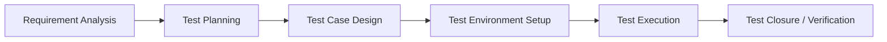

# Test Case Specification (STLC Plan)

## 1. Software Testing Life Cycle (STLC) Process

This project follows a **docs-first testing lifecycle**. Testing specifications and scenarios must be mapped out before coding begins.

---

## 2. Test Strategy

### 2.1 Frontend Testing (Vitest & happy-dom)
*   **Unit Tests:** Verify store actions, token management, and data formatting inside Zustand stores (`authStore.ts`, `eventsStore.ts`).
*   **Integration/UI Tests:** Verify React component updates, skeleton loader displays, routing security boundaries, and HeroUI component behavior. 
*   **Directory Layout**: Tests must be co-located in `__tests__/` subfolders local to each architectural layer (e.g., `src/api/__tests__/`, `src/hooks/__tests__/`, `src/components/**/__tests__/`).
*   **Network Interception**: Run MSW (Mock Service Worker) node server to intercept requests at the HTTP request layer. Configure the interceptor in `src/api/setupTests.ts` and leverage handlers and fixtures under `src/api/mocks/`.

### 2.2 Backend Testing (JUnit 5 & Mockito)
*   **Unit Tests**: Validate business rules, constraints, aspects, and validations.
    - Leverage Mockito Extension (`@ExtendWith(MockitoExtension.class)`) for mock injections.
    - Test aspects/interceptors by injecting mock `HttpServletRequest` via `RequestContextHolder.setRequestAttributes`.
*   **Mock Verification**: 
    - In V1, authenticate using mock Supabase JWT signatures processed by `SupabaseJwtFilter`.
    - In V2, verify Keycloak authentication filters with mock JWT signatures.
*   **Integration Tests**: Database transactions and row-level locking logic validated using Testcontainers (embedded/docker PostgreSQL instances).
*   **API Slices (WebMvc Tests)**: Endpoint validation using `MockMvc` and mock bean injections (via `@MockitoBean` or equivalent). Verify payload formatting, HTTP response statuses, and JSON validation schemas.
*   **Local Infrastructure Mocks (V1)**: 
    - Outgoing emails/verification codes are captured using local **Inbucket** (`http://localhost:54324`).
    - AWS S3 bucket uploads are emulated using local **MinIO** API endpoints (`http://localhost:9000`).
*   **Test Environment Config**: Disables cloud integrations (e.g., set `spring.cloud.aws.secretsmanager.enabled = false` in `src/test/resources/application.yaml`) for offline verification.

---

## 3. Test Case Specifications

### 3.1 Authentication & Profile Sync (TC-AUTH)

#### TC-AUTH-01: First Successful Login Syncs User Profile (V1 & V2)
*   **Description:** Validate that when a user logs in for the first time, their claims are written to the database.
*   **Preconditions:** Auth Provider is online. The target user ID does not exist in the database `users` table.
*   **Test Steps:**
    1.  Post login payload with valid JWT (Supabase JWT in V1, Keycloak JWT in V2) containing name, email, phone, and registration number.
    2.  Check that the backend authentication filter intercepts the JWT.
    3.  Query the local database `users` table for the matching user ID.
*   **Expected Result:** A new row is successfully created in the database containing the matching profile metadata.

#### TC-AUTH-02: SPOC Assignment and Coordinator Promotion Flow (V1 & V2)
*   **Description:** Verify Admin can assign a SPOC and SPOC can promote/demote department users.
*   **Preconditions:** System Admin account exists. Target Student and Faculty profiles exist in the database.
*   **Test Steps:**
    1.  Admin requests `POST /api/admin/spocs` to make the Faculty user a SPOC for "CSE". Verify role in DB.
    2.  As SPOC, request `POST /api/spoc/coordinators` to promote CSE Student to `STUDENT_COORDINATOR`.
    3.  Verify the Student's role in the DB becomes `STUDENT_COORDINATOR`.
    4.  Attempt demotion from SPOC. Verify role reverts to `STUDENT`.
*   **Expected Result:** Roles update successfully in the database. SPOC from CSE cannot promote ECE students (enforces department boundary).

#### TC-AUTH-03: Self-Registration Duplicate Registration Number (V1 & V2)
*   **Description:** Validate that registering with an already existing registration number rejects the request.
*   **Preconditions:** User profile exists with registration number `PEC12345`.
*   **Test Steps:**
    1.  Submit registration request containing registration number `PEC12345`.
    2.  Verify the response status and payload error code.
*   **Expected Result:** The request is rejected with `409 Conflict` and error code `REGISTRATION_NUMBER_EXISTS`.

#### TC-AUTH-04: Forgot Password OTP Dispatch & Reset (V1 & V2)
*   **Description:** Validate that the Auth Provider dispatches OTP/reset link through configured channels.
*   **Preconditions:** 
    - In V1, Supabase Auth SMTP is routed to Inbucket locally.
    - In V2, Keycloak is configured with Resend.com and MSG91.
*   **Test Steps:**
    1.  User clicks "Forgot Password" on login screen, redirecting to the recovery flow.
    2.  Select `Email` reset: Verify SMTP payload is received (Inbucket in local V1, Resend in V2).
    3.  Select `Phone` reset: Verify OTP is dispatched via SMS (Supabase Send SMS hook using MSG91 in V1, MSG91 SMS SPI in V2).
    4.  Verify OTP input completes reset and redirects user to login.
*   **Expected Result:** Recovery occurs successfully, updating credentials in the identity provider.

#### TC-AUTH-05: Self-Registration Dual OTP Verification (V2 Only)
*   **Description:** Validate that user registration successfully processes both email OTP (via Resend.com) and phone OTP (via MSG91) sequentially, and handles retries/resends.
*   **Preconditions:** Keycloak is online. SMTP and MSG91 SMS integrations are active. Registration number `PEC99999` is not registered.
*   **Test Steps:**
    1.  Submit registration details for `PEC99999` with email `newstudent@pec.edu` and phone `+919876543211`.
    2.  Assert that Keycloak triggers Email OTP dispatch via Resend.com.
    3.  Enter an incorrect Email OTP; verify verification failure and retry access.
    4.  Enter the correct Email OTP; assert Keycloak triggers Phone OTP dispatch via MSG91.
    5.  Enter correct Phone OTP; verify Keycloak completes user creation and redirects back.
*   **Expected Result:** V2 registration completes only after sequential email and phone OTP verification.

#### TC-AUTH-06: Active Login Role-Based Status Check (V1 & V2)
*   **Description:** Validate that requesting the role-based auth status endpoint retrieves user profile details and role mapping from the local database.
*   **Preconditions:** Active user session JWT exists in cookie. User profile exists in local DB with role `STUDENT`.
*   **Test Steps:**
    1.  Submit request to `GET /api/auth/me` with valid active session JWT cookie.
    2.  Verify the response status code and body.
*   **Expected Result:** Response returns status `200 OK` and a JSON body containing `userId`, `name`, `email`, `role = STUDENT`, `department`, and `registrationNumber`.

---

## 3.2 High-Concurrency Slot Control (TC-CONCUR)

#### TC-CONCUR-01: Concurrent Bookings Row-Level Lock (V1 & V2)
*   **Description:** Validate that concurrent registration requests for the last remaining seat in an event are queued and prevent overbooking.
*   **Preconditions:** An event exists with `remaining_slots = 1`.
*   **Test Steps:**
    1.  Sprout 5 concurrent threads/requests attempting registration for this event simultaneously.
    2.  Each request executes a Spring transaction acquiring row lock (`SELECT ... FOR UPDATE`).
    3.  Monitor the response statuses and database slot count.
*   **Expected Result:** Exactly 1 registration changes to `CONFIRMED` or `PENDING_PAYMENT_VERIFICATION`. The remaining 4 requests fail or go to `WAITING_LIST`. The database `remaining_slots` stays at exactly `0`.

---

## 3.3 Event Registration & Payment Verification (TC-REG)

#### TC-REG-01: Free Event Immediate Confirmation (V1 & V2)
*   **Description:** Verify that registering for a free event bypasses verification screens.
*   **Preconditions:** Event is marked free (`price = 0.00`) and has seats available.
*   **Test Steps:**
    1.  Authenticated Student submits registration request.
    2.  Assert database actions and response.
*   **Expected Result:** Registration status is immediately set to `CONFIRMED`.

#### TC-REG-02: Paid Event Registration Phasing (V1 & V2)
*   **Description:** Ensure paid registrations go to a pending state until verified.
*   **Preconditions:** Event is paid (`price = 250.00`) and has slots available.
*   **Test Steps:**
    1.  Student uploads screenshot and enters a 12-digit transaction Reference ID.
    2.  Assert status immediately is `PENDING_PAYMENT_VERIFICATION`.
    3.  Coordinator logs in, accesses dashboard queue, and approves registration.
*   **Expected Result:** Status transitions to `CONFIRMED` after Coordinator approval.

#### TC-REG-03: FCFS Waiting List Free Event Promotion (V1 & V2)
*   **Description:** Verify that when a free event is full, registrations go to the waiting list and promote on cancellation.
*   **Preconditions:** A free event has capacity = 2, with 2 confirmed registrations.
*   **Test Steps:**
    1.  Student A registers. Assert response status is `WAITING_LIST`.
    2.  One of the confirmed students cancels registration (`POST /api/registrations/{id}/cancel`).
    3.  Check Student A's registration status.
*   **Expected Result:** Student A's status is automatically updated to `CONFIRMED`, and a push notification is triggered.

#### TC-REG-04: FCFS Waiting List Paid Event Promotion & Payment Flow (V1 & V2)
*   **Description:** Verify that when a paid event is full, registrations go to the waiting list, promote to PENDING_PAYMENT, and transition to verification on screenshot upload.
*   **Preconditions:** A paid event has capacity = 2, with 2 confirmed registrations.
*   **Test Steps:**
    1.  Student B registers. Assert status is `WAITING_LIST` (no payment requested).
    2.  One confirmed student cancels.
    3.  Verify Student B's registration status becomes `PENDING_PAYMENT`.
    4.  Student B calls `POST /api/registrations/{id}/submit-payment` uploading screenshot and txn ID.
*   **Expected Result:** Student B's status becomes `PENDING_PAYMENT_VERIFICATION` for coordinator approval.

#### TC-REG-05: Faculty Registration Rejected (V1 & V2)
*   **Description:** Ensure that faculty accounts cannot register for events.
*   **Preconditions:** An active event exists. A user exists with a faculty-related role (`FACULTY`, `FACULTY_COORDINATOR`, or `SPOC`).
*   **Test Steps:**
    1.  Faculty user submits a registration request to `POST /api/events/{eventId}/register`.
    2.  Assert response status.
*   **Expected Result:** Request is rejected with `403 Forbidden` and capacity is not modified.

#### TC-REG-06: FCFS Waiting List Paid Event 24-Hour Promotion Expiry (V1 & V2)
*   **Description:** Validate that a waiting-list student promoted to PENDING_PAYMENT gets expired after 24 hours if they do not submit payment.
*   **Preconditions:** A student registration status is `PENDING_PAYMENT` with a promotion timestamp older than 24 hours. Another student registration status is `WAITING_LIST` on the same event.
*   **Test Steps:**
    1.  Trigger the automated Spring Boot backend scheduled task.
    2.  Assert the expired student's registration status becomes `EXPIRED`.
    3.  Assert the next waiting list student's registration status becomes `PENDING_PAYMENT`.
*   **Expected Result:** Expired registration updates to `EXPIRED`. The next student is promoted and notified.

#### TC-REG-07: FCFS Waiting List Payment Re-upload Grace Period (V1 & V2)
*   **Description:** Validate that a payment rejection transitions to PAYMENT_REJECTED and grants a 12-hour grace period before expiring.
*   **Preconditions:** A registration status is `PENDING_PAYMENT_VERIFICATION`.
*   **Test Steps:**
    1.  Coordinator rejects the payment. Verify status transitions to `PAYMENT_REJECTED`.
    2.  Mock passage of time past 12 hours without re-upload.
    3.  Trigger the backend scheduled task.
*   **Expected Result:** On rejection, status becomes `PAYMENT_REJECTED`. If 12 hours pass without re-upload, status transitions to `EXPIRED` and the next waiting list student is promoted.

#### TC-REG-08: Collaborator Management Access Boundaries (V1 & V2)
*   **Description:** Verify that only the original event creator or department SPOC can manage collaborators.
*   **Preconditions:** An event created by Faculty Coordinator A exists. Faculty Coordinator B is assigned as a collaborator on the event.
*   **Test Steps:**
    1.  Faculty Coordinator B attempts to assign Student Coordinator C as a collaborator. Verify `403 Forbidden`.
    2.  Faculty Coordinator A (creator) attempts to assign C. Verify `200 OK`.
*   **Expected Result:** Access controls restrict collaborator modifications to creators and SPOCs.

---

## 3.4 Web Push Alerts (TC-PUSH)

#### TC-PUSH-01: User Subscribes and Receives Push Notifications (V1 & V2)
*   **Description:** Verify service worker registration and notification dispatch.
*   **Preconditions:** Browser grants notification permission.
*   **Test Steps:**
    1.  Frontend captures registration token using the server's VAPID key.
    2.  Send subscription details to backend endpoint.
    3.  Trigger event status update from backend.
*   **Expected Result:** 
    - In V1, Spring Boot signs the VAPID payload and dispatches it directly via `@Async` task threads to the push service.
    - In V2, Spring Boot pushes event to RabbitMQ, where a worker consumes it to trigger push service dispatch.
    - User browser receives the OS-level notification popup.

---

## 3.5 Asynchronous Message Queuing (TC-MSG) (V2 Only)

#### TC-MSG-01: RabbitMQ Notification Event Queuing and Consumption
*   **Description:** Validate that publishing an event sends a message to RabbitMQ, which is consumed to send a push notification.
*   **Preconditions:** RabbitMQ is running. The notification queue is active.
*   **Test Steps:**
    1.  Publish a new event via the backend.
    2.  Assert that a message is successfully published to `pec.events.exchange` with routing key `event.published`.
    3.  Verify that the notification listener consumes the message and dispatches push alerts to registered devices.
*   **Expected Result:** Message is queued, consumed asynchronously, and push alerts are successfully dispatched (Only verified in V2).

---

## 3.6 In-Memory Caching (TC-CACHE) (V2 Only)

#### TC-CACHE-01: Redis Cache Hit and Invalidation
*   **Description:** Verify that event query results are cached in Redis and invalidated on update actions.
*   **Preconditions:** Redis cache is active and empty.
*   **Test Steps:**
    1.  Request `GET /api/events` (Event listing). Assert database is queried.
    2.  Request `GET /api/events` again. Assert response is served from Redis (no DB hit).
    3.  Publish a new event (`POST /api/events`).
    4.  Request `GET /api/events` again. Assert database is queried again and cache is refilled.
*   **Expected Result:** Subsequent listing hits the cache, and writes invalidate the cache key `events::list` immediately (Only verified in V2).
