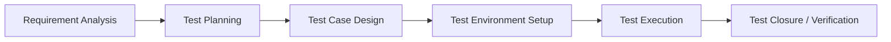

# Test Case Specification (STLC Plan)

## 1. Software Testing Life Cycle (STLC) Process

This project follows a **docs-first testing lifecycle**. Testing specifications and scenarios must be mapped out before coding begins.

---

## 2. Test Strategy

### 2.1 Frontend Testing (Vitest & React Testing Library)
*   **Unit Tests:** Verify store actions, token management, and data formatting inside Zustand stores (`authStore.ts`, `eventsStore.ts`).
*   **Integration/UI Tests:** Verify React component updates, skeleton loader displays, routing security boundaries, and HeroUI component behavior.

### 2.2 Backend Testing (JUnit 5 & Spring Boot Test)
*   **Mock Verification:** Keycloak authentication filters verified with mock JWT signatures.
*   **Integration Tests:** Database transactions and row-level locking logic validated using Testcontainers (embedded/docker PostgreSQL instances).
*   **API Tests:** Endpoint validation with MockMvc checks.

---

## 3. Test Case Specifications

### 3.1 Authentication & Profile Sync (TC-AUTH)

#### TC-AUTH-01: First Successful Login Syncs User Profile
*   **Description:** Validate that when a user logs in for the first time, their claims are written to the database.
*   **Preconditions:** Keycloak is online. The target user ID does not exist in the database `users` table.
*   **Test Steps:**
    1.  Post login payload with valid Keycloak JWT containing name, email, department, and student role.
    2.  Check that the REST filter intercepts the JWT.
    3.  Query the local database `users` table for the matching user ID.
*   **Expected Result:** A new row is successfully created in the database containing the matching profile metadata.

---

### 3.2 High-Concurrency Slot Control (TC-CONCUR)

#### TC-CONCUR-01: Concurrent Bookings Row-Level Lock
*   **Description:** Validate that concurrent registration requests for the last remaining seat in an event are queued and prevent overbooking.
*   **Preconditions:** An event exists with `remaining_slots = 1`.
*   **Test Steps:**
    1.  Sprout 5 concurrent threads/requests attempting registration for this event simultaneously.
    2.  Each request executes a Spring transaction acquiring row lock (`SELECT ... FOR UPDATE`).
    3.  Monitor the response statuses and database slot count.
*   **Expected Result:** Exactly 1 registration changes to `CONFIRMED`. The remaining 4 requests fail with a `409 Conflict` or sold-out error status. The database `remaining_slots` stays at exactly `0`.

---

### 3.3 Event Registration & Payment Verification (TC-REG)

#### TC-REG-01: Free Event Immediate Confirmation
*   **Description:** Verify that registering for a free event bypasses verification screens.
*   **Preconditions:** Event is marked free (`price = 0.00`) and has seats available.
*   **Test Steps:**
    1.  Authenticated Student submits registration request.
    2.  Assert database actions and response.
*   **Expected Result:** Registration status is immediately set to `CONFIRMED`. Event capacity decrements immediately.

#### TC-REG-02: Paid Event Registration Phasing
*   **Description:** Ensure paid registrations go to a pending state until verified.
*   **Preconditions:** Event is paid (`price = 250.00`).
*   **Test Steps:**
    1.  Student uploads screenshot and enters a 12-digit transaction Reference ID.
    2.  Assert status immediately.
    3.  Coordinator logs in, accesses dashboard queue, and approves registration.
*   **Expected Result:** Upon submission, the registration status is set to `PENDING_PAYMENT_VERIFICATION`. After Coordinator approval, the status transitions to `CONFIRMED` and the event capacity is decremented by 1.

---

### 3.4 Web Push Alerts (TC-PUSH)

#### TC-PUSH-01: User Subscribes and Receives Push Notifications
*   **Description:** Verify service worker registration and notification dispatch.
*   **Preconditions:** Browser grants notification permission.
*   **Test Steps:**
    1.  Frontend captures registration token using the server's VAPID key.
    2.  Send subscription details to backend endpoint.
    3.  Trigger status update from backend to `CONFIRMED`.
*   **Expected Result:** Service worker intercepts signed VAPID payload and raises OS-level notification.
