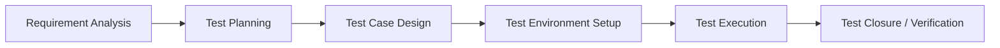

# Test Case Specification (STLC Plan)

## 1. Software Testing Life Cycle (STLC) Process

This project follows a **docs-first testing lifecycle**. Testing specifications and scenarios must be mapped out before coding begins.

---

## 2. Test Strategy

### 2.1 Frontend Testing (Vitest & React Testing Library)
*   **Unit Tests:** Verify store actions, token management, and data formatting inside Zustand stores (`authStore.ts`, `eventsStore.ts`).
*   **Integration/UI Tests:** Verify React component updates, skeleton loader displays, routing security boundaries, and HeroUI component behavior.

### 2.2 Backend Testing (JUnit 5 & Spring Boot Test)
*   **Mock Verification:** Keycloak authentication filters verified with mock JWT signatures.
*   **Integration Tests:** Database transactions and row-level locking logic validated using Testcontainers (embedded/docker PostgreSQL instances).
*   **API Tests:** Endpoint validation with MockMvc checks.

---

## 3. Test Case Specifications

### 3.1 Authentication & Profile Sync (TC-AUTH)

#### TC-AUTH-01: First Successful Login Syncs User Profile
*   **Description:** Validate that when a user logs in for the first time, their claims are written to the database.
*   **Preconditions:** Keycloak is online. The target user ID does not exist in the database `users` table.
*   **Test Steps:**
    1.  Post login payload with valid Keycloak JWT containing name, email, department, and student role.
    2.  Check that the REST filter intercepts the JWT.
    3.  Query the local database `users` table for the matching user ID.
*   **Expected Result:** A new row is successfully created in the database containing the matching profile metadata.

#### TC-AUTH-02: SPOC Assignment and Coordinator Promotion Flow
*   **Description:** Verify Admin can assign a SPOC and SPOC can promote/demote department users.
*   **Preconditions:** System Admin account exists. Target Student and Faculty profiles exist in the database.
*   **Test Steps:**
    1.  Admin requests `POST /api/admin/spocs` to make the Faculty user a SPOC for "CSE". Verify role in DB.
    2.  As SPOC, request `POST /api/spoc/coordinators` to promote CSE Student to `STUDENT_COORDINATOR`.
    3.  Verify the Student's role in the DB becomes `STUDENT_COORDINATOR`.
    4.  Attempt demotion from SPOC. Verify role reverts to `STUDENT`.
*   **Expected Result:** Roles update successfully, and auth context updates. SPOC from CSE cannot promote ECE students (enforces department boundary).

#### TC-AUTH-03: Self-Registration Duplicate Registration Number
*   **Description:** Validate that registering with an already existing registration number rejects the request and prompts login redirect.
*   **Preconditions:** User profile exists with registration number `PEC12345`.
*   **Test Steps:**
    1.  Submit self-registration payload with registration number `PEC12345`.
    2.  Verify the response status and payload error code.
*   **Expected Result:** The request is rejected with `409 Conflict` and error code `REGISTRATION_NUMBER_EXISTS`. The client redirects to the login view.

#### TC-AUTH-04: Forgot Password OTP Dispatch & Reset (Email/SMS)
*   **Description:** Validate that Keycloak dispatches OTP/reset link through Resend.com and Twilio.
*   **Preconditions:** Keycloak is configured with Resend.com SMTP and the Twilio SMS Authenticator SPI. User profile exists with registration number `PEC12345`, email `student@pec.edu`, and phone `+919876543210`.
*   **Test Steps:**
    1.  User clicks "Forgot Password" on login screen, redirecting to Keycloak recovery screen.
    2.  Select `Email` reset: Keycloak dispatches reset link/code via Resend.com SMTP relay. Verify SMTP payload.
    3.  Select `Phone` reset: Keycloak dispatches OTP via Twilio SMS SPI. Verify mock SMS gateway receipt.
    4.  Verify OTP input completes reset and redirects user to login screen.
*   **Expected Result:** Keycloak recovers password using the correct provider SMTP/SMS APIs, updating password context in Keycloak.

---

### 3.2 High-Concurrency Slot Control (TC-CONCUR)

#### TC-CONCUR-01: Concurrent Bookings Row-Level Lock
*   **Description:** Validate that concurrent registration requests for the last remaining seat in an event are queued and prevent overbooking.
*   **Preconditions:** An event exists with `remaining_slots = 1`.
*   **Test Steps:**
    1.  Sprout 5 concurrent threads/requests attempting registration for this event simultaneously.
    2.  Each request executes a Spring transaction acquiring row lock (`SELECT ... FOR UPDATE`).
    3.  Monitor the response statuses and database slot count.
*   **Expected Result:** Exactly 1 registration changes to `CONFIRMED`. The remaining 4 requests fail with a `409 Conflict` or sold-out error status. The database `remaining_slots` stays at exactly `0`.

---

### 3.3 Event Registration & Payment Verification (TC-REG)

#### TC-REG-01: Free Event Immediate Confirmation
*   **Description:** Verify that registering for a free event bypasses verification screens.
*   **Preconditions:** Event is marked free (`price = 0.00`) and has seats available.
*   **Test Steps:**
    1.  Authenticated Student submits registration request.
    2.  Assert database actions and response.
*   **Expected Result:** Registration status is immediately set to `CONFIRMED`.

#### TC-REG-02: Paid Event Registration Phasing
*   **Description:** Ensure paid registrations go to a pending state until verified.
*   **Preconditions:** Event is paid (`price = 250.00`) and has slots available.
*   **Test Steps:**
    1.  Student uploads screenshot and enters a 12-digit transaction Reference ID.
    2.  Assert status immediately.
    3.  Coordinator logs in, accesses dashboard queue, and approves registration.
*   **Expected Result:** Upon submission, the registration status is set to `PENDING_PAYMENT_VERIFICATION`. After Coordinator approval, the status transitions to `CONFIRMED`.

#### TC-REG-03: FCFS Waiting List Free Event Promotion
*   **Description:** Verify that when a free event is full, registrations go to the waiting list and promote on cancellation.
*   **Preconditions:** A free event has capacity = 2, with 2 confirmed registrations.
*   **Test Steps:**
    1.  Student A registers. Assert response status is `WAITING_LIST`.
    2.  One of the confirmed students cancels registration (`POST /api/registrations/{id}/cancel`).
    3.  Check Student A's registration status.
*   **Expected Result:** Student A's status is automatically updated to `CONFIRMED`, and a push notification is triggered for them.

#### TC-REG-04: FCFS Waiting List Paid Event Promotion & Payment Flow
*   **Description:** Verify that when a paid event is full, registrations go to the waiting list, promote to PENDING_PAYMENT, and transition to verification on screenshot upload.
*   **Preconditions:** A paid event has capacity = 2, with 2 confirmed registrations.
*   **Test Steps:**
    1.  Student B registers. Assert status is `WAITING_LIST` (no payment requested).
    2.  One confirmed student cancels.
    3.  Verify Student B's registration status becomes `PENDING_PAYMENT`.
    4.  Student B calls `POST /api/registrations/{id}/submit-payment` uploading screenshot and txn ID.
*   **Expected Result:** Student B's status becomes `PENDING_PAYMENT_VERIFICATION` for the coordinator to approve.

#### TC-REG-05: Faculty Registration Rejected
*   **Description:** Ensure that faculty accounts cannot register for events.
*   **Preconditions:** An active event exists. A user exists with a faculty-related role (`FACULTY`, `FACULTY_COORDINATOR`, or `SPOC`).
*   **Test Steps:**
    1.  Faculty user submits a registration request to `POST /api/events/{eventId}/register`.
    2.  Assert response status.
*   **Expected Result:** The request is rejected with a `403 Forbidden` error and the event capacity is not modified.

#### TC-REG-06: FCFS Waiting List Paid Event 24-Hour Promotion Expiry
*   **Description:** Validate that a waiting-list student promoted to PENDING_PAYMENT gets expired after 24 hours if they do not submit payment.
*   **Preconditions:** A student registration status is `PENDING_PAYMENT` with a promotion timestamp older than 24 hours. Another student registration status is `WAITING_LIST` on the same event.
*   **Test Steps:**
    1.  Trigger the automated Spring Boot backend scheduled task.
    2.  Assert the expired student's registration status.
    3.  Assert the next waiting list student's registration status.
*   **Expected Result:** The expired student's registration is updated to `EXPIRED`. The next student's registration is automatically updated to `PENDING_PAYMENT`, and a push notification is sent to them.

#### TC-REG-07: FCFS Waiting List Payment Re-upload Grace Period
*   **Description:** Validate that a payment rejection transitions to PAYMENT_REJECTED and grants a 12-hour grace period before expiring.
*   **Preconditions:** A registration status is `PENDING_PAYMENT_VERIFICATION`.
*   **Test Steps:**
    1.  An assigned coordinator rejects the payment. Verify status transitions to `PAYMENT_REJECTED`.
    2.  Wait/Mock passage of time past 12 hours without re-upload.
    3.  Trigger the backend scheduled task.
*   **Expected Result:** On rejection, registration is marked `PAYMENT_REJECTED`. If 12 hours pass without a re-upload, status transitions to `EXPIRED` and the next waiting list student is promoted.

#### TC-REG-08: Collaborator Management Access Boundaries
*   **Description:** Verify that only the original event creator or department SPOC can manage collaborators.
*   **Preconditions:** An event created by Faculty Coordinator A exists. Faculty Coordinator B is assigned as a collaborator on the event.
*   **Test Steps:**
    1.  Faculty Coordinator B attempts to assign Student Coordinator C as a collaborator on the event.
    2.  Assert response status.
    3.  Faculty Coordinator A (creator) attempts to assign Student Coordinator C.
    4.  Assert response status.
*   **Expected Result:** Faculty Coordinator B's request is rejected with `403 Forbidden`. Faculty Coordinator A's request is accepted with `200 OK`.

---

### 3.4 Web Push Alerts (TC-PUSH)

#### TC-PUSH-01: User Subscribes and Receives Push Notifications
*   **Description:** Verify service worker registration and notification dispatch.
*   **Preconditions:** Browser grants notification permission.
*   **Test Steps:**
    1.  Frontend captures registration token using the server's VAPID key.
    2.  Send subscription details to backend endpoint.
    3.  Trigger status update from backend to `CONFIRMED`.
*   **Expected Result:** Service worker intercepts signed VAPID payload and raises OS-level notification.

---

### 3.5 Asynchronous Message Queuing (TC-MSG)

#### TC-MSG-01: RabbitMQ Notification Event Queuing and Consumption
*   **Description:** Validate that publishing an event sends a message to RabbitMQ, which is consumed to send a push notification.
*   **Preconditions:** RabbitMQ is running. The notification queue is active.
*   **Test Steps:**
    1.  Publish a new event via the backend.
    2.  Assert that a message is successfully published to `pec.events.exchange` with routing key `event.published`.
    3.  Verify that the notification listener consumes the message and dispatches push alerts to registered devices.
*   **Expected Result:** Message is queued, consumed asynchronously, and push alerts are successfully dispatched.

---

### 3.6 In-Memory Caching (TC-CACHE)

#### TC-CACHE-01: Redis Cache Hit and Invalidation
*   **Description:** Verify that event query results are cached in Redis and invalidated on update actions.
*   **Preconditions:** Redis cache is active and empty.
*   **Test Steps:**
    1.  Request `GET /api/events` (Event listing). Assert database is queried.
    2.  Request `GET /api/events` again. Assert response is served from Redis (no DB hit).
    3.  Publish a new event (`POST /api/events`).
    4.  Request `GET /api/events` again. Assert database is queried again and cache is refilled.
*   **Expected Result:** The subsequent listing hits the cache, and writes invalidate the cache key `events::list` immediately.
