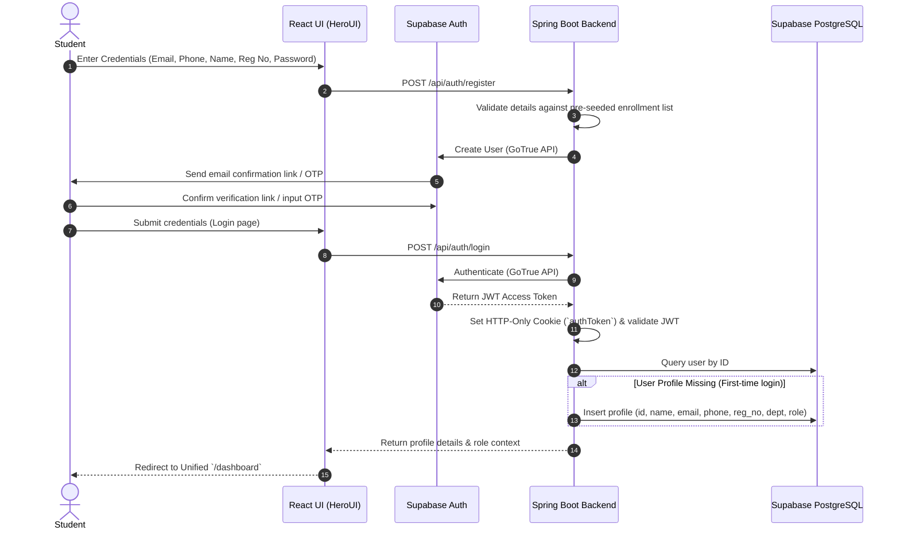
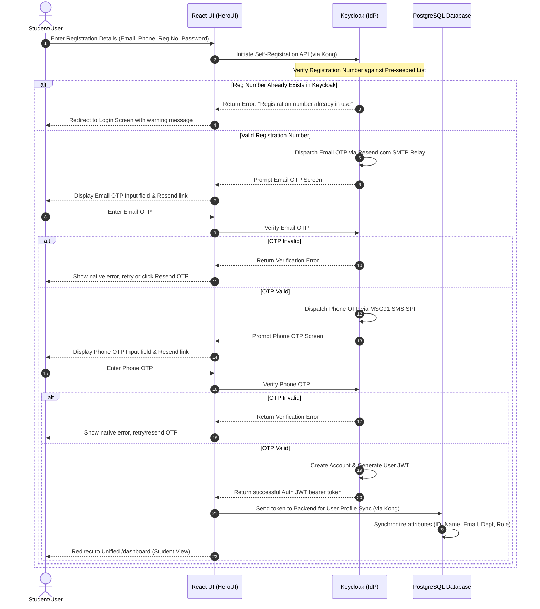
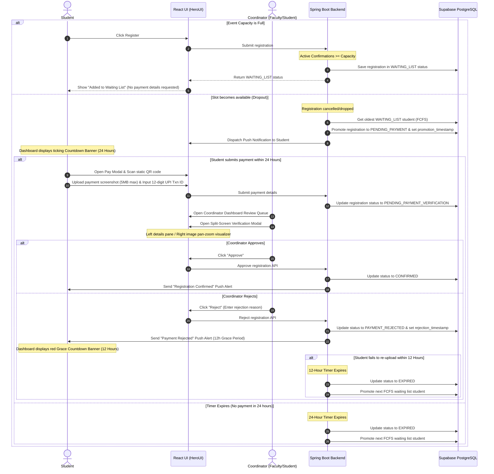

# User Flow and UI Development Documentation

This document serves as the UI/UX specification and reference guide for front-end developers and AI agents building user interfaces for Prathyusha Engineering College's (PEC) Events Management Application.

---

## 1. Design System & Brand Aesthetics

All interfaces must strictly adhere to the project's styling boundaries to ensure a consistent, premium academic-tech look.

### Theme Variables & Styling Framework
- **Framework**: React 19, HeroUI v3 (previously NextUI), Tailwind CSS v4, and React Aria.
- **Icon Library**: Gravity UI Icons (`@gravity-ui/icons`) MUST be used for all UI icons (including close buttons, chevron arrows, zoom/rotate indicators, navigation bar, status badges, etc.).
- **Color Palette**:
  - **Primary Brand Accent**: Maroon Red (`#a80000`) for call-to-action buttons, active navigation markers, selection borders, focus outlines, and primary links.
  - **Light Mode (Default)**: Bright slate/white backgrounds (`#f8fafc`, `#ffffff`) with charcoal gray typography.
  - **Dark Mode**: Deep charcoal backgrounds (`#121212`, `#1e1e1e` for container surfaces and cards) with off-white typography, avoiding pure pitch-black (#000000).
- **Typography**: Sleek, legible sans-serif typefaces (Google Font **Inter** or **Outfit**) configured in the Tailwind theme block.
- **Micro-Animations**: Subtle hover transitions on buttons, cards, and list items (e.g., `transition-all duration-200 ease-in-out scale-95` on clicks, `hover:translate-y-[-2px]`).
- **Loading States**: Skeletons (using HeroUI `Skeleton` component) displayed in place of event cards, registration tables, and dashboard components during async data fetching.
- **Accessibility (WCAG)**: Proper focus indicator rings (utilizing React Aria states), appropriate keyboard navigability (`Tab` progression, `Enter` activation), and ARIA landmark tags (`aria-label`, `aria-describedby`) for interactive modal overlays.


---

## 2. Directory Layout & State Separation

The React application implements a strict 3-layer structural breakdown:

```
src/
├── api/         # 1. API Layer (pure Axios/Fetch calls returning promises, no UI side effects)
├── stores/      # 2. State Layer (Zustand stores tracking JWT, user profile state, data formatting)
└── components/  # 3. View Layer (pure HeroUI component views subscribing to stores)
    └── pages/
```

- **API Layer**: Exposes stateless endpoints like `getEvents()`, `submitPayment()`, `syncProfile()`.
- **State Layer**: Maintains in-memory stores (e.g., `useAuthStore` for session JWT and token parsing, `useRegistrationStore` for checkout statuses).
- **View Layer**: Components must consume state exclusively via selectors (e.g., `const user = useAuthStore(state => state.user)`) and trigger handlers exposed by the stores.

---

## 3. Core Interaction & Page Flows

### 3.1 Unified Layout Routing (`/dashboard`)
To simplify route guards and component layouts:
- A single user-facing route `/dashboard` is declared.
- Upon mounting, the layout wrapper checks the authenticated user context for roles (`STUDENT`, `STUDENT_COORDINATOR`, `FACULTY_COORDINATOR`, `SPOC`, `ADMIN`).
  - **In Version 1**: Renders layout based on role retrieved from the backend API `/api/profile` (or decoded from the Supabase JWT metadata).
  - **In Version 2**: Renders layout based on role claims found directly in the Keycloak JWT token attributes.
- Depending on the user's role, the dashboard dynamically renders the appropriate sub-layout:
  - **Student Sub-layout**: Event browsing grid, active registrations tab, countdown banners.
  - **Coordinator Sub-layout**: Quick-actions panel, event listing editor, payment review queue tab.
  - **SPOC Sub-layout**: Department coordinator management tab, audit logs, department event overview.
  - **Admin Sub-layout**: Management panels, CSV enrollment uploader, global system parameters (including keycloak link configuration in V2).

---

### 3.2 User Registration and Authentication Flow

#### 3.2.1 Version 1 Registration & Profile Sync (Supabase Auth)
In V1, user registration and login are orchestrated via custom React forms routed through the Spring Boot backend auth proxy:
1. **Details Input**: The student enters registration credentials (Registration Number, Email, Phone, Name, Password) on the React registration page.
2. **Validation & Proxy Request**: The React client posts the credentials to the Spring Boot endpoint `/api/auth/register`. Spring Boot validates the user details against the pre-seeded department enrollment database, then calls Supabase Auth on the server-side via GoTrue admin/client APIs to create the account.
3. **Email Verification**: Supabase dispatches a confirmation email containing a magic link or 6-digit OTP code to verify the account.
4. **First Login Profile Sync**: Once verified, the user logs in via the React client calling Spring Boot's `/api/auth/login` endpoint. Spring Boot logs the user in via Supabase, retrieves the JWT, sets the JWT inside an HTTP-only cookie (`authToken`), checks if the user profile exists in the database `users` table, and inserts the synced metadata if missing.

#### 3.2.2 Version 2 Registration & Dual-OTP Flow (Keycloak)
In V2, registration redirects users to Keycloak-hosted login/registration portals behind the Kong Gateway:
1. **Unique ID Validation**: The user provides registration credentials. If the Registration Number is already matched to an active Keycloak user, they are immediately redirected to the login page with an error banner: *“Registration number already in use. Please log in.”*
2. **Sequential Dual-OTP Verification**:
   - **Step 1: Email OTP**: Keycloak dispatches an OTP code to the email via Resend.com SMTP relay. React UI renders a countdown timer for code entry.
   - **Step 2: Phone OTP**: Upon email validation success, Keycloak dispatches a SMS OTP via MSG91 SMS SPI.
   - **Completion**: Once both OTPs are validated, Keycloak completes account creation and redirects back with the authorization code.

---

### 3.3 Paid Event Payment Submission Modal (V1)
When registering for a paid event with open slots, the UI opens the Payment Submission modal.

- **UPI QR Container**: Renders a clean static UPI QR code pointing to the coordinator's UPI ID, accompanied by copyable details.
- **Form Inputs & Validation**:
  - **Transaction Reference ID**: A single text field enforcing a strict 12-digit numeric regular expression filter (`^\d{12}$`). Submissions are blocked and show an error warning unless the input is exactly 12 numeric digits.
  - **Screenshot Upload**: Drag-and-drop file uploader area. Enforces client-side file checks (maximum file size of 5MB, accepted formats restricted to `.png`, `.jpg`, and `.jpeg`).
  - **Live Preview**: Upon file selection, renders a clear image thumbnail preview of the uploaded payment receipt.
- **Submission State**: The registration is sent to the backend, updating the student's status to `PENDING_PAYMENT_VERIFICATION`.

---

### 3.4 Verification Dashboard Split-Screen Modal
Coordinators review payment screenshots in a dedicated split-screen Verification Modal.

- **Left Pane (Details Grid)**:
  - Renders student profile details (Name, Registration Number, Department, Email).
  - Displays event name and price.
  - Displays the 12-digit UPI transaction reference ID alongside a copy-to-clipboard button widget.
- **Right Pane (Interactive Image Viewer)**:
  - Renders the uploaded screenshot file fetched from the AWS S3 URL.
  - Controls: Interactive buttons for **Zoom In**, **Zoom Out**, **Rotate 90°**, and **Toggle Full-Screen** to verify low-resolution receipts.
- **Footer Controls**:
  - **Approve Button**: Triggers validation, transitioning registration status to `CONFIRMED`.
  - **Reject Button**: Opens an overlay text area requesting a mandatory rejection reason. Submission transitions status to `PAYMENT_REJECTED`, notifying the student.

---

### 3.5 FCFS Waiting List & Live Expiry Timers
When a slot opens due to a dropout, FCFS waiting list promotions trigger visual countdown states on the Student dashboard.

- **Promotion Alert**: When promoted to `PENDING_PAYMENT` (24 hours to pay) or `PAYMENT_REJECTED` (12-hour grace period to re-upload), a persistent banner appears at the top of the Student dashboard.
- **Live Countdown Timer**:
  - Ticks down every second based on the offset between the backend server timestamp and the expiration deadline.
  - **Severity Color Coding**:
    - **Green (>12 hours remaining)**: Sleek, reassuring outline banner.
    - **Orange (2 to 12 hours remaining)**: Solid warning background alert.
    - **Flashing Red (<2 hours remaining)**: High-priority flashing red alert urging immediate payment submission.
  - **Call to Action**: Contains a primary button redirecting directly to the Payment Modal.

---

### 3.6 Collaborator Autocomplete Search Flow
Faculty Coordinators and SPOCs can assign event collaborators dynamically.

- **Department Autocomplete Input**: Search field dynamically filters active Student and Faculty coordinators *only* from the creator's academic department.
- **Selection Visuals**: Selected coordinators are appended below the search bar as interactive badges/chips containing their name, role, and avatar picture.
- **Removal**: Badge chips feature a close icon (`Xmark` from `@gravity-ui/icons`) to immediately remove the collaborator from the assignment list.
- **Access Limits**: Student Coordinators can view assigned collaborators but cannot add or remove them.

---

### 3.7 Push Notification Soft-Prompt Banner
To maximize Web Push subscription opt-ins:
- Instead of triggering the browser's native permission request instantly on load, the UI displays a soft-prompt banner inside the Dashboard layout.
- The banner highlights clear benefits: *“Enable notifications to receive instant updates on event registrations, waiting list promotions, and payment approvals.”*
- Clicking "Allow Notifications" triggers the service worker registration, retrieves the browser token subscription via VAPID key, posts it to the backend, and closes the banner.

---

## 4. Mermaid Flow Diagrams

### 4.1.1 Version 1 Supabase Auth Registration & Sync Process



### 4.1.2 Version 2 Keycloak Dual-OTP Registration Process



---

### 4.2 Waitlist Promotion, Payment Modal, and Verification Dashboard Flow


